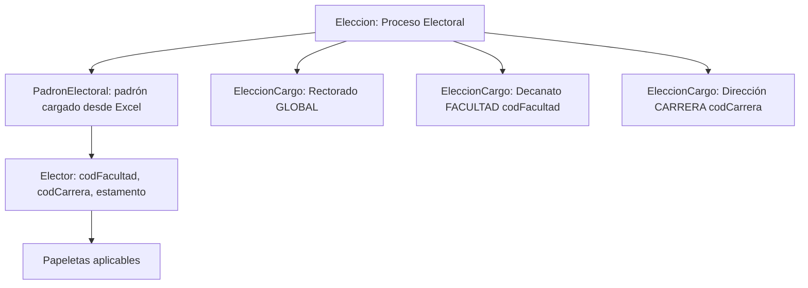
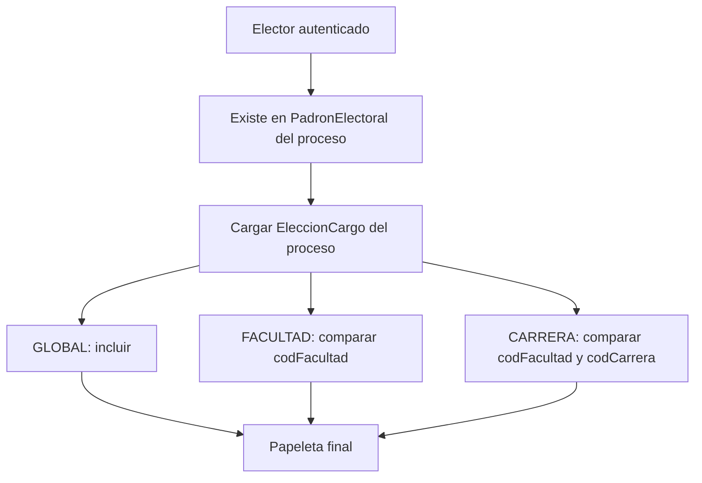

# Plan Backend — Gestión De Elecciones Multialcance

## Decisión De Modelo

Mantener `[SW2-grupal-backend/src/elecciones/entities/eleccion.entity.ts](SW2-grupal-backend/src/elecciones/entities/eleccion.entity.ts)` como el **Proceso Electoral / Evento Principal**. Ya cumple ese rol: tiene `titulo`, `gestion`, `fecha`, `estaActiva` y es la FK usada por `[SW2-grupal-backend/src/elecciones/entities/padron-electoral.entity.ts](SW2-grupal-backend/src/elecciones/entities/padron-electoral.entity.ts)`.

Refactorizar `[SW2-grupal-backend/src/elecciones/entities/eleccion-cargo.entity.ts](SW2-grupal-backend/src/elecciones/entities/eleccion-cargo.entity.ts)` para que sea la **Papeleta/Sub-elección concreta** dentro del proceso. Ahí debe vivir el alcance, porque el mismo catálogo `Cargo` puede usarse en distintos procesos con distinto ámbito.

## Esquemas Propuestos

### `Eleccion` como `ProcesoElectoral`

Conservar tabla `eleccion` por compatibilidad. Opcionalmente renombrar a nivel de código más adelante, no de inmediato.

Campos actuales a mantener:
- `id`
- `titulo`
- `gestion`
- `fecha`
- `restriccionAlfabeticaActiva`
- `estaActiva`
- `administrador`
- `eleccionCargos`

Campos recomendados a futuro:
- `estado`: `BORRADOR | CONFIGURADA | PADRON_CARGADO | ACTIVA | CERRADA | ANULADA`
- `descripcion` nullable
- `fechaInicio` / `fechaFin` si la jornada deja de ser de un solo día

### `Cargo` como catálogo maestro

Mantener `[SW2-grupal-backend/src/elecciones/entities/cargo.entity.ts](SW2-grupal-backend/src/elecciones/entities/cargo.entity.ts)` como catálogo simple.

Recomendación:
- `nombre`: Rector, Decano, Director de Carrera
- El campo actual `facultad` debería deprecarse o hacerse nullable, porque la facultad/carrera específica ya no pertenece al catálogo, sino a la papeleta concreta.
- Opcional: `tipoCargo`: `RECTOR | DECANO | DIRECTOR_CARRERA | OTRO` para evitar reglas por texto como `cargo.nombre === 'RECTOR'`.

### `EleccionCargo` como `Papeleta` / `SubEleccion`

Agregar columnas:
- `alcance`: enum `GLOBAL | FACULTAD | CARRERA`
- `codFacultad`: nullable, requerido si `alcance = FACULTAD` o `CARRERA`
- `facultadNombre`: nullable, snapshot descriptivo para UI
- `codCarrera`: nullable, requerido si `alcance = CARRERA`
- `carreraNombre`: nullable, snapshot descriptivo para UI
- `orden`: int default 0 para ordenar papeletas
- `estaActiva`: bool default true para ocultar papeletas incompletas

Restricciones recomendadas:
- `GLOBAL`: `codFacultad IS NULL` y `codCarrera IS NULL`
- `FACULTAD`: `codFacultad NOT NULL` y `codCarrera IS NULL`
- `CARRERA`: `codFacultad NOT NULL` y `codCarrera NOT NULL`
- índice `(eleccion_id, alcance, codFacultad, codCarrera, cargo_id)` para evitar duplicar la misma papeleta.

### `PadronElectoral`

Mantener el vínculo actual `(eleccion, elector)` porque el padrón se carga al **Proceso Electoral principal**, no a cada cargo.

Cambios recomendados:
- Mantener `estaHabilitado`, `codLugar`, `lugarVotacion`.
- Deprecar gradualmente `habilitadoRector`; será reemplazado por reglas de alcance. Mientras se migra, puede mapearse como compatibilidad para cargos `GLOBAL` tipo `RECTOR`.
- No crear filas por cada papeleta, salvo que más adelante haya excepciones manuales de elegibilidad por cargo.

Entidad opcional si se necesita override manual fino:
- `PadronPapeletaHabilitacion`
- Campos: `eleccionCargo`, `elector`, `estaHabilitado`, `motivo`
- Unique `(eleccionCargo, elector)`
- Usarla solo para excepciones, no para materializar todo el padrón.

### `Elector`

Mantener `[SW2-grupal-backend/src/electores/entities/elector.entity.ts](SW2-grupal-backend/src/electores/entities/elector.entity.ts)` como catálogo global.

Campos críticos para la nueva arquitectura:
- `codFacultad` para Decanato
- `codCarrera` para Dirección de Carrera
- `estamento` para reglas si una papeleta aplica solo a estudiantes/docentes en el futuro
- `registroDocente` para login dual

Recomendación: validar que el parser Excel siempre deje `codFacultad` consistente para estudiantes y docentes, y `codCarrera` solo para estudiantes cuando aplique.

### `RegistroSufragio`

Cambiar el modelo de “un voto por elección” a “un voto por papeleta aplicable”.

Campos nuevos/requeridos:
- `eleccion`: se mantiene para consultas rápidas del proceso
- `eleccionCargo`: FK obligatoria a la papeleta/sub-elección
- `elector`: se mantiene
- `hashTransaccion`: se mantiene

Restricción nueva:
- Unique `(eleccionCargo, elector)`

Eliminar o reemplazar la restricción actual:
- Actual: unique `(eleccion, elector)`
- Nueva lógica: el elector puede votar varias papeletas dentro del mismo proceso, pero solo una vez por cada `EleccionCargo`.

## Filtrado De Papeleta Para El Votante

El endpoint actual `[SW2-grupal-backend/src/elecciones/services/papeleta.service.ts](SW2-grupal-backend/src/elecciones/services/papeleta.service.ts)` debe cambiar de regla especial Rector a una regla general:

1. Buscar elector por `registro` o `registroDocente`.
2. Verificar `PadronElectoral` por `(eleccionId, electorId)` y `estaHabilitado = true`.
3. Cargar `eleccion.eleccionCargos` con `cargo`, `frentes`, `candidatos`.
4. Filtrar cada `EleccionCargo`:
   - `GLOBAL`: aplica a todos los electores habilitados en el padrón.
   - `FACULTAD`: aplica si `elector.codFacultad === eleccionCargo.codFacultad`.
   - `CARRERA`: aplica si `elector.codFacultad === eleccionCargo.codFacultad` y `elector.codCarrera === eleccionCargo.codCarrera`.
5. Excluir papeletas inactivas o sin frentes/candidatos si así lo decide la regla de UI.

## Cambios En Votación

Actualizar `[SW2-grupal-backend/src/elecciones/dto/voto/emitir-voto.dto.ts](SW2-grupal-backend/src/elecciones/dto/voto/emitir-voto.dto.ts)` para incluir `eleccionCargoId` o inferirlo desde el candidato. Recomiendo exigirlo explícitamente para mayor claridad.

Validaciones en `[SW2-grupal-backend/src/elecciones/services/voto.service.ts](SW2-grupal-backend/src/elecciones/services/voto.service.ts)`:
- La elección existe y está activa.
- El elector está en el padrón del proceso.
- El `eleccionCargo` pertenece a la elección.
- El candidato/frente pertenece a ese `eleccionCargo`.
- El elector es elegible para esa papeleta según `alcance`.
- No existe `RegistroSufragio` para `(eleccionCargo, elector)`.

Blockchain:
- El contrato actual parece registrar doble voto por `(eleccion, elector)`. Para multi-papeleta debe incluir dimensión de papeleta, por ejemplo `eleccionCargoId` o hash compuesto `eleccionId:eleccionCargoId`.
- Si no se toca el contrato todavía, una alternativa temporal es registrar cada papeleta como una “elección blockchain” distinta usando `eleccionCargoId` como clave on-chain, mientras la BD conserva `eleccionId` como proceso padre.

## Plan De Acción Paso A Paso

1. **Congelar vocabulario de dominio**
   - Decidir si en código se seguirá llamando `Eleccion` o si se introducirá alias progresivo `ProcesoElectoral`.
   - Recomiendo mantener `Eleccion` en BD y APIs base por ahora para reducir impacto.

2. **Agregar enum y columnas de alcance en `EleccionCargo`**
   - Crear `AlcancePapeletaEnum` con `GLOBAL`, `FACULTAD`, `CARRERA`.
   - Agregar `codFacultad`, `facultadNombre`, `codCarrera`, `carreraNombre`, `orden`, `estaActiva`.
   - Migrar cargos existentes como `GLOBAL` o según datos actuales.

3. **Ajustar DTOs y endpoints de cargos/papeletas**
   - `CrearCargoDto` o un nuevo `CrearPapeletaDto` debe recibir `eleccionId`, `cargoId` o `nombreCargo`, `alcance`, códigos y nombres.
   - Separar mejor “catálogo de cargos” de “configuración de papeletas del proceso”.

4. **Refactorizar `PapeletaService`**
   - Reemplazar `habilitadoRector` y comparación por nombre `RECTOR` por filtrado genérico basado en `alcance`.
   - Devolver metadata del alcance en cada cargo para que el frontend pueda mostrar “Rectorado”, “Decanato: Facultad X”, “Dirección: Carrera Y”.

5. **Actualizar `VotoService` y `RegistroSufragio`**
   - Migrar unique de `(eleccion, elector)` a `(eleccionCargo, elector)`.
   - Validar elegibilidad por alcance antes de registrar voto.
   - Guardar `eleccionCargo` en el sufragio para auditoría y certificado.

6. **Actualizar integración blockchain**
   - Opción recomendada: adaptar contrato a clave `(proceso, papeleta, elector)`.
   - Opción incremental: usar `eleccionCargoId` como identificador on-chain de la elección específica.

7. **Actualizar estadísticas y escrutinio**
   - Agrupar resultados por `EleccionCargo`.
   - Calcular participación por papeleta y participación general del proceso.
   - Evitar ganador global mezclando Rector, Decano y Dirección.

8. **Mantener padrón vinculado al proceso**
   - La carga Excel debe seguir llamando `POST /elecciones/:eleccionId/padron`.
   - La FK sigue siendo `PadronElectoral.eleccion`.
   - Los campos `codFacultad` y `codCarrera` del elector son los que determinan sus papeletas aplicables.

9. **Compatibilidad temporal**
   - Mantener `habilitadoRector` por una versión si el frontend actual depende de él.
   - Internamente mapear Rector como `GLOBAL` y dejar de usar flags especiales en nuevas papeletas.

10. **Pruebas necesarias**
   - Cargar padrón al proceso principal.
   - Crear una papeleta `GLOBAL` Rector.
   - Crear una papeleta `FACULTAD` Decano para `codFacultad = 15`.
   - Crear una papeleta `CARRERA` Dirección para `codCarrera = 157-1`.
   - Verificar que un elector de otra facultad no vea Decanato incorrecto.
   - Verificar que un estudiante de otra carrera no vea Dirección incorrecta.
   - Verificar que puede votar una vez por cada papeleta aplicable, no una sola vez por todo el proceso.

## Riesgos Principales

- `RegistroSufragio` y blockchain actuales bloquean un segundo voto dentro del mismo proceso.
- `Cargo.facultad` es texto libre y no debe usarse como regla de elegibilidad.
- `habilitadoRector` es una excepción que no escala; debe migrarse a alcance `GLOBAL`.
- El escrutinio actual debe agruparse por papeleta para evitar mezclar resultados.
- El frontend deberá pasar `eleccionCargoId` al votar o mantener seleccionado explícitamente el cargo/papeleta.