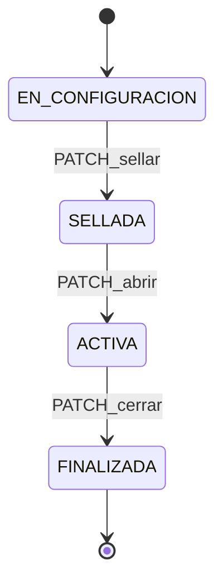
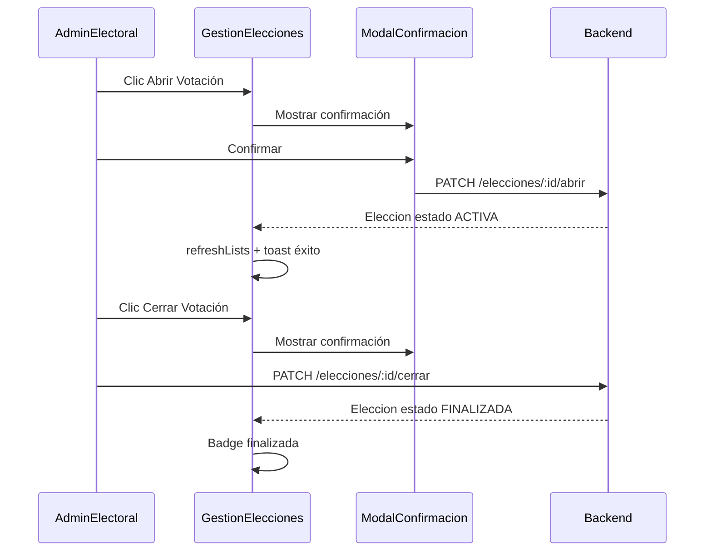

# Plan: Control de Jornada Electoral (CU-07)

**Entregable acordado:** [`plan_control_jornada.md`](plan_control_jornada.md) en la raíz del repo.

---

## 1. Objetivo

Permitir al **Administrador Electoral** abrir y cerrar manualmente la jornada de votación, independiente del reloj del sistema (vital para pruebas y defensa de tesis), mediante:

- `PATCH /api/elecciones/:id/abrir` → `SELLADA` → `ACTIVA`
- `PATCH /api/elecciones/:id/cerrar` → `ACTIVA` → `FINALIZADA` (habilita CU-18)

---

## 2. Hallazgos del código actual

### 2.1 Backend — lógica ya implementada (sin exponer REST)

| Archivo | Qué hace hoy |
|---------|--------------|
| [`jornada.service.ts`](SW2-grupal-backend/src/elecciones/services/jornada.service.ts) | `controlarEstadoJornada(eleccionId, 'ABRIR' \| 'CERRAR')` y `obtenerEstadoJornada()` |
| [`elecciones.module.ts`](SW2-grupal-backend/src/elecciones/elecciones.module.ts) | `JornadaService` registrado como provider, **sin controller** |
| [`elecciones.controller.ts`](SW2-grupal-backend/src/elecciones/controllers/elecciones.controller.ts) | CRUD + `PATCH :id/sellar`; **no hay abrir/cerrar** |
| [`estado-eleccion.enum.ts`](SW2-grupal-backend/src/elecciones/enums/estado-eleccion.enum.ts) | `EN_CONFIGURACION`, `SELLADA`, `ACTIVA`, `FINALIZADA` |
| [`elecciones.service.ts`](SW2-grupal-backend/src/elecciones/services/elecciones.service.ts) | `sellarEleccion()` → `EN_CONFIGURACION` → `SELLADA` |
| [`voto.service.ts`](SW2-grupal-backend/src/elecciones/services/voto.service.ts) | Bloquea voto si `!estaActiva` (salvo `BYPASS_ELECTION_TIME`) |
| [`escrutinio.service.ts`](SW2-grupal-backend/src/elecciones/services/escrutinio.service.ts) | Consolidación CU-18 exige jornada cerrada + `FINALIZADA` |

**Comportamiento actual de `JornadaService` al abrir/cerrar:**

```typescript
// ABRIR
eleccion.estaActiva = true;
eleccion.estado = EstadoEleccionEnum.ACTIVA;

// CERRAR
eleccion.estaActiva = false;
eleccion.estado = EstadoEleccionEnum.FINALIZADA;
```

**Validaciones actuales al abrir (si `BYPASS_ELECTION_TIME !== true`):**
- Jornada no debe estar ya abierta (`estaActiva`)
- Fecha de elección = hoy
- Hora entre 08:00 y 16:00

**Validaciones actuales al cerrar:**
- `estaActiva === true`

### 2.2 Gaps respecto al requerimiento

| Gap | Detalle | Acción propuesta |
|-----|---------|------------------|
| G1 | No hay endpoints REST | Agregar `PATCH .../abrir` y `PATCH .../cerrar` |
| G2 | ABRIR no valida `estado === SELLADA` | Rechazar si no está sellada (evita abrir desde `EN_CONFIGURACION`) |
| G3 | CERRAR no valida `estado === ACTIVA` | Rechazar si no está en jornada activa formal |
| G4 | `EstadoJornada` no devuelve campo `estado` | Extender respuesta con `estado` para sincronizar UI |
| G5 | Sin guard de rol en jornada | Aplicar `ElectoralGuard` (ya existe en [`electoral.guard.ts`](SW2-grupal-backend/src/administradores/guards/electoral.guard.ts)) |
| G6 | Frontend usa checkbox manual `estaActiva` | Deprecar edición manual; jornada solo vía botones |
| G7 | Tabla muestra "Activa/Inactiva" por `estaActiva` | Mostrar `estado` con `formatEstadoEleccion()` |

### 2.3 Máquina de estados objetivo



| Estado | `estaActiva` | Acciones permitidas |
|--------|--------------|---------------------|
| `EN_CONFIGURACION` | false | Configurar padrón, frentes, papeletas |
| `SELLADA` | false | **Abrir Votación** |
| `ACTIVA` | true | Votar; **Cerrar Votación** |
| `FINALIZADA` | false | CU-18 Consolidación; sin controles de jornada |

---

## 3. Diseño Backend

### 3.1 Endpoints propuestos

Registrar en [`elecciones.controller.ts`](SW2-grupal-backend/src/elecciones/controllers/elecciones.controller.ts) **antes** de `@Patch(':eleccionId')` genérico (mismo patrón que `/sellar`):

| Método | Ruta | Guard | Servicio | Efecto |
|--------|------|-------|----------|--------|
| `PATCH` | `/elecciones/:eleccionId/abrir` | JWT + `ElectoralGuard` | `JornadaService.controlarEstadoJornada(id, 'ABRIR')` | `SELLADA` → `ACTIVA`, `estaActiva=true` |
| `PATCH` | `/elecciones/:eleccionId/cerrar` | JWT + `ElectoralGuard` | `JornadaService.controlarEstadoJornada(id, 'CERRAR')` | `ACTIVA` → `FINALIZADA`, `estaActiva=false` |
| `GET` | `/elecciones/:eleccionId/jornada` *(opcional)* | JWT + `ElectoralGuard` | `obtenerEstadoJornada()` | Consulta sin mutación |

**Respuesta sugerida** (extender `EstadoJornada`):

```typescript
{
  eleccionId: string;
  titulo: string;
  estado: EstadoEleccionEnum;      // nuevo
  estaActiva: boolean;
  fecha: Date;
  accionEjecutada: 'ABRIR' | 'CERRAR';
}
```

Devolver también la entidad `Eleccion` completa en el wrapper `ApiResponse` para que el frontend refresque la tabla sin otro GET.

### 3.2 Refactor de validaciones en `JornadaService`

**ABRIR** — reglas finales:

1. `estado === SELLADA` (nuevo; mensaje: "Solo se puede abrir una elección sellada.")
2. `!estaActiva`
3. Si no hay bypass: fecha = hoy y hora 08:00–16:00 (mantener para producción; bypass activo en demo/tesis vía [`ConfiguracionSistema.jsx`](SW2-grupal-frontend/src/pages/admin/sistemas/ConfiguracionSistema.jsx) → `BYPASS_ELECTION_TIME`)

**CERRAR** — reglas finales:

1. `estado === ACTIVA` y `estaActiva === true`
2. Transición irreversible a `FINALIZADA`

**Errores HTTP:**

| Caso | Código | Mensaje |
|------|--------|---------|
| Elección no existe | 404 | NotFoundException |
| Abrir desde estado incorrecto | 400 | BadRequestException |
| Abrir fuera de horario/fecha | 403 | ForbiddenException |
| Cerrar jornada ya cerrada | 400 | BadRequestException |

### 3.3 Alternativa descartada

Crear lógica duplicada en `elecciones.service.ts`. **No recomendado:** `JornadaService` ya centraliza RF5; los endpoints solo deben delegar.

### 3.4 Protección contra edición manual de `estaActiva`

En [`actualizarEleccion`](SW2-grupal-backend/src/elecciones/services/elecciones.service.ts): ignorar o rechazar cambios directos de `estaActiva` / `estado` desde el PATCH genérico cuando `estado !== EN_CONFIGURACION`, forzando el flujo sellar → abrir → cerrar.

---

## 4. Diseño Frontend

### 4.1 Servicio API

Agregar en [`electionsService.js`](SW2-grupal-frontend/src/services/electionsService.js):

```javascript
export async function abrirJornada(eleccionId) {
  const response = await api.patch(`/elecciones/${eleccionId}/abrir`)
  return response?.data?.data || response?.data
}

export async function cerrarJornada(eleccionId) {
  const response = await api.patch(`/elecciones/${eleccionId}/cerrar`)
  return response?.data?.data || response?.data
}
```

Actualizar JSDoc `EstadoEleccion` para incluir `FINALIZADA`.

### 4.2 Helpers de UI

Extender [`electionConstants.js`](SW2-grupal-frontend/src/utils/electionConstants.js):

```javascript
export function canAbrirJornada(estado) {
  return estado === ESTADO_ELECCION.SELLADA
}

export function canCerrarJornada(estado, estaActiva) {
  return estado === ESTADO_ELECCION.ACTIVA && estaActiva
}

export function isJornadaFinalizada(estado) {
  return estado === ESTADO_ELECCION.FINALIZADA
}
```

Opcional: badges de color por estado (verde ACTIVA, gris SELLADA, azul FINALIZADA).

### 4.3 Cambios en [`GestionElecciones.jsx`](SW2-grupal-frontend/src/pages/admin/electoral/GestionElecciones.jsx)

#### Ubicación de controles

**Opción recomendada:** columna nueva **"Jornada"** en la tabla de elecciones (junto a "Estado"), una fila = una elección.

| `election.estado` | UI |
|-------------------|-----|
| `SELLADA` | Botón verde **"Abrir Votación"** |
| `ACTIVA` + `estaActiva` | Botón rojo **"Cerrar Votación"** |
| `FINALIZADA` | Badge **"Jornada finalizada"** (sin botones) |
| `EN_CONFIGURACION` | Texto muted: "Debe sellar la elección primero" + enlace contextual a Configuración de Papeleta |

#### Columna "Estado"

Reemplazar `{election.estaActiva ? 'Activa' : 'Inactiva'}` por:

```jsx
{formatEstadoEleccion(election.estado)}
```

#### Formulario de edición

- **Eliminar** checkbox "Elección activa" del formulario de crear/editar (evita saltarse la máquina de estados).
- Mantener campos de título, gestión, fecha y restricción alfabética.
- Deshabilitar edición/eliminación de elecciones en `ACTIVA` o `FINALIZADA` (solo lectura operativa).

### 4.4 Modales de confirmación

Reutilizar patrón de [`SealElectionModal.jsx`](SW2-grupal-frontend/src/pages/admin/electoral/components/SealElectionModal.jsx).

**Nuevos componentes:**

| Archivo | Propósito |
|---------|-----------|
| `components/AbrirJornadaModal.jsx` | Confirmar apertura |
| `components/CerrarJornadaModal.jsx` | Confirmar cierre |

**Copy sugerido — Abrir:**

> ¿Confirma abrir la jornada electoral? Los electores habilitados podrán emitir su voto. Asegúrese de que el contrato esté desplegado en blockchain.

**Copy sugerido — Cerrar:**

> ¿Confirma cerrar la jornada electoral? Esta acción es irreversible. No se aceptarán más votos y la elección pasará a estado **Finalizada**, habilitando la consolidación de resultados (CU-18).

Botones: Cancelar / Confirmar (con spinner durante la petición).

### 4.5 Flujo UX



---

## 5. Integración con módulos existentes

| Módulo | Efecto del cierre |
|--------|-------------------|
| [`ConsolidacionResultados.jsx`](SW2-grupal-frontend/src/pages/admin/electoral/ConsolidacionResultados.jsx) | Desbloquea generación de acta cuando `FINALIZADA` |
| [`EstadisticasEnVivo.jsx`](SW2-grupal-frontend/src/pages/admin/electoral/EstadisticasEnVivo.jsx) | Sigue funcionando en ACTIVA; post-FINALIZADA datos estáticos |
| [`VotingBallot.jsx`](SW2-grupal-frontend/src/pages/VotingBallot.jsx) | Solo vota si `estaActiva` |
| [`ConfiguracionPapeleta.jsx`](SW2-grupal-frontend/src/pages/admin/electoral/ConfiguracionPapeleta.jsx) | Sellado previo obligatorio antes de abrir |

---

## 6. Plan de implementación por fases

### Fase A — Backend (1–2 h)

1. Reforzar validaciones de estado en `JornadaService` (SELLADA/ACTIVA).
2. Extender interface `EstadoJornada` con campo `estado`.
3. Inyectar `JornadaService` en `EleccionesController`.
4. Agregar `PATCH abrir`, `PATCH cerrar` con `ElectoralGuard`.
5. Bloquear mutación manual de `estaActiva`/`estado` en PATCH genérico.

### Fase B — Frontend (2–3 h)

1. Funciones `abrirJornada` / `cerrarJornada` en `electionsService.js`.
2. Helpers en `electionConstants.js`.
3. Modales `AbrirJornadaModal` y `CerrarJornadaModal`.
4. Refactor tabla en `GestionElecciones.jsx`: columna Jornada + estado formal.
5. Eliminar checkbox manual "Elección activa".

### Fase C — QA / demo tesis

1. Activar `BYPASS_ELECTION_TIME=true` en Configuración del Sistema.
2. Flujo completo: crear → configurar → sellar → **abrir** → votar → **cerrar** → consolidar CU-18.
3. Verificar errores: abrir sin sellar, cerrar dos veces, votar con jornada cerrada.

---

## 7. Criterios de aceptación

- Botón verde **Abrir Votación** visible solo en `SELLADA`.
- Botón rojo **Cerrar Votación** visible solo en `ACTIVA`.
- Badge **Jornada finalizada** en `FINALIZADA`; sin controles de jornada.
- Ambos botones requieren modal de confirmación explícita.
- Endpoints devuelven elección actualizada; tabla se refresca sin recargar página.
- Cierre dispara `FINALIZADA` y desbloquea CU-18.
- Con `BYPASS_ELECTION_TIME=true`, abrir funciona fuera de horario/fecha para pruebas.
- Rol SISTEMAS no puede abrir/cerrar jornada (solo ELECTORAL).

---

## 8. Qué NO hacer en esta iteración

- No automatizar apertura/cierre por cron o smart contract.
- No reabrir elecciones `FINALIZADA`.
- No mover la UI de jornada a otra pantalla (permanece en Gestión de Elección).
- No eliminar validaciones de horario en producción (solo bypass configurable).
