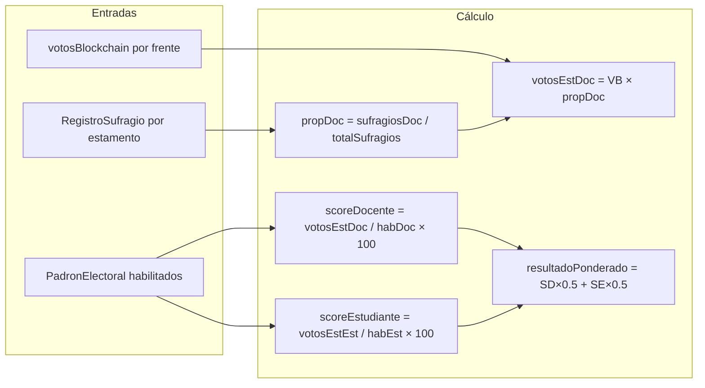
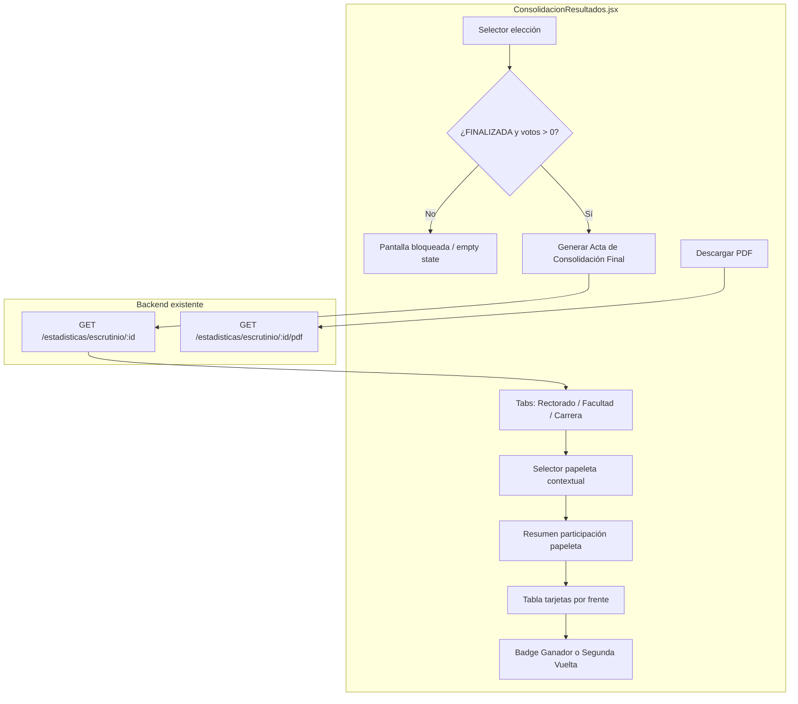

# Plan CU-18: Consolidación Paritaria (Administrador Electoral)

**Entregable acordado:** [`plan_consolidacion_cu18.md`](plan_consolidacion_cu18.md) en la raíz del repo (mismo formato que [`plan_refactor_estadisticas.md`](plan_refactor_estadisticas.md)).

---

## 1. Objetivo

Implementar el **CU-18 (Generar reporte de consolidación paritaria)** como vista legal exclusiva del **Administrador Electoral**, separada de la auditoría técnica blockchain (CU-20, rol **SISTEMAS**).

La pantalla objetivo será [`SW2-grupal-frontend/src/pages/admin/electoral/ConsolidacionResultados.jsx`](SW2-grupal-frontend/src/pages/admin/electoral/ConsolidacionResultados.jsx), reemplazando conceptualmente a [`ResultadosAuditoria.jsx`](SW2-grupal-frontend/src/pages/admin/electoral/ResultadosAuditoria.jsx) (hoy mal nombrada como "Auditoría y Resultados").

---

## 2. Auditoría: qué lógica ya existe

### 2.1 Backend — motor de cálculo (reutilizable al 100% como base)

| Archivo | Función | Rol |
|---------|---------|-----|
| [`escrutinio.service.ts`](SW2-grupal-backend/src/elecciones/services/escrutinio.service.ts) | `calcularResultadosParitarios()` | RF10: escrutinio 50/50 |
| | `calcularResultadoFrenteParitario()` | Fórmula matemática por frente |
| | `generarReporteConsolidacion()` | RF18: reporte + firma simulada |
| | `generarActaPDF()` | Acta PDF con `pdf-lib` |
| [`estadisticas.controller.ts`](SW2-grupal-backend/src/elecciones/controllers/estadisticas.controller.ts) | `GET escrutinio/:eleccionId` | JSON del reporte |
| | `GET escrutinio/:eleccionId/pdf` | Descarga PDF |
| [`blockchain.service.ts`](SW2-grupal-backend/src/blockchain/services/blockchain.service.ts) | `obtenerVotos(eleccionCargoId, frenteId)` | Votos válidos on-chain por papeleta |
| [`voto.service.ts`](SW2-grupal-backend/src/elecciones/services/voto.service.ts) | `votar()` | Emisión + `RegistroSufragio` (auditoría sin candidato) |
| [`papeleta-eligibility.service.ts`](SW2-grupal-backend/src/elecciones/services/papeleta-eligibility.service.ts) | `esPapeletaAplicable()` | Elegibilidad por alcance (ya corregida para docente transversal en CARRERA) |

### 2.2 Fórmula de ponderación paritaria existente

Implementada en `calcularResultadoFrenteParitario()`:



**Interpretación legal del puntaje:** `resultadoPonderado` es un valor 0–100 donde 50 representa participación paritaria plena en ambos estamentos. La regla validada por el equipo: **Ganador si `resultadoPonderado > 50`**, caso contrario **Segunda Vuelta**.

### 2.3 Contrato API ya expuesto

**Frontend** — [`estadisticasService.js`](SW2-grupal-frontend/src/services/estadisticasService.js):
- `getReporteConsolidacion(eleccionId)` → `GET /estadisticas/escrutinio/:eleccionId`
- `descargarActaPDF(eleccionId)` → `GET /estadisticas/escrutinio/:eleccionId/pdf`

**Estructuras clave** (`ReporteConsolidacion`):

```typescript
{
  reporte: {
    eleccionId, tituloEleccion, fechaEleccion,
    totalHabilitados, totalHabilitadosDocentes, totalHabilitadosEstudiantes,
    totalSufragiosEmitidos, totalElectoresParticipantes,
    totalSufragiosDocentes, totalSufragiosEstudiantes,
    participacionPorcentaje,
    resultadosPorPapeleta: ResultadoPapeletaEscrutinio[],  // ← USAR ESTO
    resultadosPorFrente: ResultadoFrenteParitario[],         // legacy/aplanado
    ganador, fuenteVotos: 'blockchain' | 'simulado'
  },
  fechaGeneracion, firmaSimulada, version
}
```

Por frente (`ResultadoFrenteParitario`): `votosBlockchain`, `porcentajeTotal`, `scoreDocente`, `scoreEstudiante`, `resultadoPonderado`.

Por papeleta (`ResultadoPapeletaEscrutinio`): `eleccionCargoId`, `cargoNombre`, `alcance`, `codFacultad`, `codCarrera`, `resultadosPorFrente[]`, `ganador`.

### 2.4 Frontend existente (referencia, no reutilizar tal cual)

| Archivo | Estado |
|---------|--------|
| [`ResultadosAuditoria.jsx`](SW2-grupal-frontend/src/pages/admin/electoral/ResultadosAuditoria.jsx) | CU-18 parcial; agrega frentes entre papeletas (incorrecto); copy de "blockchain" confunde |
| [`EstadisticasEnVivo.jsx`](SW2-grupal-frontend/src/pages/admin/electoral/EstadisticasEnVivo.jsx) | **Patrón UI a replicar:** tabs GLOBAL/FACULTAD/CARRERA + selector de papeleta |
| [`estadisticasHierarchy.js`](SW2-grupal-frontend/src/utils/estadisticasHierarchy.js) | Helpers de agrupación por alcance y labels |
| [`electionConstants.js`](SW2-grupal-frontend/src/utils/electionConstants.js) | `formatEstadoEleccion`, helpers de estado |

### 2.5 Separación de roles (decisión del equipo)

| Rol | Pantalla | Ruta actual | Propuesta |
|-----|----------|-------------|-----------|
| **ELECTORAL** | Consolidación legal CU-18 | `/admin/auditoria-resultados` | `/admin/consolidacion-resultados` |
| **SISTEMAS** | Auditoría blockchain CU-20 | `/admin/auditoria` | Sin cambios |

Sidebar: renombrar ítem `audit` de "Auditoría y Resultados" → **"Consolidación de Resultados"** en [`AdminLayout.jsx`](SW2-grupal-frontend/src/layouts/AdminLayout.jsx).

---

## 3. Gaps detectados (corregir durante implementación)

Estos gaps **no bloquean** el plan, pero deben abordarse para que CU-18 sea legalmente correcto en elecciones multialcance:

| # | Gap | Impacto | Acción propuesta |
|---|-----|---------|------------------|
| G1 | `calcularResultadosParitarios()` usa **habilitados y sufragios globales** de toda la elección para calcular scores de **cada papeleta** | Scores incorrectos en FACULTAD/CARRERA | Extender `EscrutinioService` para calcular `habDoc/habEst/sufragios` **por papeleta** usando `PapeletaEligibilityService` (mismo patrón que [`estadisticas.service.ts`](SW2-grupal-backend/src/elecciones/services/estadisticas.service.ts)) |
| G2 | UI y PDF **aplanan/suman** frentes de distintas papeletas | Ganador global incorrecto | UI consume solo `resultadosPorPapeleta[]`; eliminar agregación client-side |
| G3 | No existe estado `FINALIZADA` en [`estado-eleccion.enum.ts`](SW2-grupal-backend/src/elecciones/enums/estado-eleccion.enum.ts) | Gate de negocio no alineado | Agregar `FINALIZADA` + transición al cerrar jornada (`estaActiva=false`) |
| G4 | Escrutinio valida `!estaActiva`, no `FINALIZADA` | Inconsistencia con requisito UX | Backend: `ForbiddenException` si jornada abierta **o** estado ≠ `FINALIZADA` (con migración) |
| G5 | No hay lógica de **Segunda Vuelta** | Etiqueta dinámica imposible | Nueva función `determinarVeredicto(resultadoPonderado, empate?)` en backend + frontend |
| G6 | Endpoints escrutinio solo tienen `JwtAuthGuard` | Cualquier JWT accede | Agregar guard de rol **ELECTORAL** (análogo a `SistemasGuard`) |
| G7 | Fallback `fuenteVotos: 'simulado'` con `Math.random()` | Riesgo en producción | UI debe mostrar banner de advertencia; plan futuro: bloquear acta si no hay blockchain |
| G8 | PDF agrega frentes entre papeletas | Acta legal incorrecta en multialcance | Refactor `generarActaPDF()` para emitir **una sección por papeleta** |

---

## 4. Arquitectura de la nueva pantalla



### 4.1 Estructura de archivos propuesta

```
SW2-grupal-frontend/src/
├── pages/admin/electoral/
│   ├── ConsolidacionResultados.jsx          # Pantalla principal CU-18
│   └── components/consolidacion/
│       ├── ConsolidacionEmptyState.jsx      # Jornada abierta / sin votos / sin papeletas
│       ├── ConsolidacionScopeTabs.jsx       # Tabs Rectorado / Facultad / Carrera
│       ├── ConsolidacionBallotSelector.jsx  # Select papeleta dentro del tab
│       ├── ConsolidacionSummaryCards.jsx    # Habilitados, sufragios, participación
│       ├── ConsolidacionFrenteCard.jsx      # Votos absolutos + scores + veredicto
│       └── ConsolidacionActaActions.jsx     # Botones generar + PDF + hash integridad
├── utils/
│   └── consolidacionHierarchy.js          # Agrupar resultadosPorPapeleta, veredicto >50%
```

**Reutilización directa (sin duplicar lógica matemática):**
- Cálculo 50/50: **solo backend** (`calcularResultadoFrenteParitario`)
- Agrupación UI: adaptar [`estadisticasHierarchy.js`](SW2-grupal-frontend/src/utils/estadisticasHierarchy.js) → `consolidacionHierarchy.js` (mismos `ALCANCE_TAB`, `formatPapeletaStatsLabel`, `groupPapeletasByAlcance`)
- API: [`estadisticasService.js`](SW2-grupal-frontend/src/services/estadisticasService.js) sin cambios de contrato (posible extensión de campos)

---

## 5. UI por jerarquía (Rectorado / Facultad / Carrera)

Seguir el patrón probado de [`EstadisticasEnVivo.jsx`](SW2-grupal-frontend/src/pages/admin/electoral/EstadisticasEnVivo.jsx):

1. **Selector de elección** (desde `fetchElections()`).
2. **Validación de acceso** antes de mostrar resultados (ver sección 7).
3. **Tabs dinámicos** según papeletas presentes en `reporte.resultadosPorPapeleta`:
   - `GLOBAL` → **Rectorado**
   - `FACULTAD` → **Facultad**
   - `CARRERA` → **Carrera**
4. **Selector contextual** si hay >1 papeleta en el tab activo.
5. **Panel de papeleta seleccionada** con:
   - Encabezado: cargo + ámbito (facultad/carrera)
   - Participación docente/estudiante **de esa papeleta** (post-fix G1)
   - Lista ordenada de frentes por `resultadoPonderado` descendente
   - Badge de veredicto en el frente líder

**No mostrar** `reporte.resultadosPorFrente` ni `reporte.ganador` global en la UI principal (solo referencia informativa opcional al final si el equipo lo pide).

---

## 6. Métricas por frente: votos absolutos, ponderado y veredicto

Por cada frente en la papeleta activa, mostrar:

| Campo API | Presentación UI |
|-----------|-----------------|
| `votosBlockchain` | **Votos absolutos** (on-chain, válidos) |
| `porcentajeTotal` | % sobre total de la papeleta |
| `scoreDocente`, `scoreEstudiante` | Desglose 50/50 con contribución `(score × 0.5)` |
| `resultadoPonderado` | **Puntaje final ponderado** (destacado) |

### Regla de veredicto (validada)

```javascript
function determinarVeredicto(frentesOrdenados) {
  if (!frentesOrdenados.length || frentesOrdenados[0].votosBlockchain === 0) {
    return { tipo: 'SIN_DATOS', label: 'Sin votos registrados' }
  }
  const lider = frentesOrdenados[0]
  const segundo = frentesOrdenados[1]
  const empate = segundo && segundo.resultadoPonderado === lider.resultadoPonderado
  if (empate) return { tipo: 'SEGUNDA_VUELTA', label: 'Segunda Vuelta' }
  if (lider.resultadoPonderado > 50) return { tipo: 'GANADOR', label: 'Ganador' }
  return { tipo: 'SEGUNDA_VUELTA', label: 'Segunda Vuelta' }
}
```

**Badge visual:**
- `GANADOR` → verde institucional + trofeo (reutilizar estilo de [`ResultadosAuditoria.jsx`](SW2-grupal-frontend/src/pages/admin/electoral/ResultadosAuditoria.jsx))
- `SEGUNDA_VUELTA` → ámbar + ícono de balota
- `SIN_DATOS` → gris neutro

Implementar en backend (`EscrutinioService`) como campo `veredicto: 'GANADOR' | 'SEGUNDA_VUELTA' | 'SIN_DATOS'` en `ResultadoPapeletaEscrutinio` para que PDF y UI compartan la misma fuente de verdad.

---

## 7. Acción "Generar Acta de Consolidación Final"

### Flujo UX

1. Usuario selecciona elección **FINALIZADA** con votos.
2. Clic en **"Generar Acta de Consolidación Final"** → `getReporteConsolidacion()` → renderiza resultados en pantalla.
3. Clic en **"Descargar Acta (PDF)"** → `descargarActaPDF()` → blob PDF.
4. Pie de página: `fechaGeneracion`, `firmaSimulada`, `fuenteVotos` (banner si `'simulado'`).

### Mejoras al PDF (fase backend)

Refactorizar `generarActaPDF()` para:
- Una sección por papeleta (`resultadosPorPapeleta`)
- Veredicto por papeleta (Ganador / Segunda Vuelta)
- Eliminar suma de `resultadoPonderado` entre papeletas
- Opcional: botón **Imprimir** en frontend (`window.print()` con CSS `@media print`) como complemento al PDF

**No reimplementar** generación PDF en frontend; reutilizar endpoint existente.

---

## 8. Manejo de estados vacío, error y bloqueo

### Matriz de estados

| Condición | Comportamiento UI |
|-----------|-------------------|
| Elección `EN_CONFIGURACION` / `SELLADA` | Bloqueo: "La jornada electoral aún no ha finalizado." |
| Elección `ACTIVA` o `estaActiva === true` | Bloqueo: botones deshabilitados + mensaje |
| Elección `FINALIZADA` + `totalSufragiosEmitidos === 0` | Empty state: "No hay sufragios para consolidar." |
| Elección `FINALIZADA` + sin papeletas configuradas | Empty state: "Configure papeletas antes de consolidar." |
| `403` backend (jornada abierta) | Mostrar mensaje del API |
| `fuenteVotos === 'simulado'` | Banner amarillo: "Datos simulados — verifique conexión blockchain." |
| Sin reporte generado aún | Placeholder instructivo con CTA al botón generar |

### Cambio de modelo de estado (backend)

```typescript
// estado-eleccion.enum.ts — agregar:
FINALIZADA = 'FINALIZADA'

// jornada.service.ts o elecciones.service.ts — al cerrar jornada:
eleccion.estaActiva = false
eleccion.estado = EstadoEleccionEnum.FINALIZADA
```

Migración TypeORM: `AddEstadoFinalizadaEleccion.ts`.

Frontend: extender [`electionConstants.js`](SW2-grupal-frontend/src/utils/electionConstants.js) con `isEleccionFinalizada(estado, estaActiva)` para gating UX.

---

## 9. Cambios backend mínimos recomendados (fase 1)

Sin reescribir el motor, solo extender lo existente:

1. **`EscrutinioService.calcularResultadosParitarios()`**
   - Por cada `eleccionCargo`: calcular `habDoc`, `habEst`, `sufragiosDoc`, `sufragiosEst` filtrados por elegibilidad de papeleta.
   - Pasar esos totales a `calcularResultadoFrenteParitario()` en lugar de globales.
   - Agregar `veredicto` y `veredictoLabel` por papeleta.

2. **`EstadisticasController`**
   - Agregar guard de rol ELECTORAL en endpoints `escrutinio/*`.

3. **`generarActaPDF()`**
   - Render por papeleta + veredicto.

4. **Enum + migración `FINALIZADA`**
   - Validación en escrutinio alineada con UX.

---

## 10. Plan de implementación por fases

### Fase A — Backend (extensión, no reescritura)
- Migración `FINALIZADA`
- Escrutinio por papeleta con elegibilidad
- Campo `veredicto` en respuesta
- Guard ELECTORAL
- PDF por papeleta

### Fase B — Frontend CU-18
- Crear `ConsolidacionResultados.jsx` + componentes
- Crear `consolidacionHierarchy.js`
- Ruta `/admin/consolidacion-resultados` + sidebar
- Deprecar/redirigir `/admin/auditoria-resultados` → nueva ruta
- Eliminar copy de "blockchain" en pantalla electoral

### Fase C — QA y validación legal
- Elección multialcance: ganadores distintos por papeleta
- Carrera con docente transversal: scores correctos
- Veredicto >50% vs ≤50%
- Empate exacto → Segunda Vuelta
- PDF coincide con pantalla

---

## 11. Criterios de aceptación

- Solo rol **ELECTORAL** accede a consolidación (frontend + backend).
- Rol **SISTEMAS** no ve CU-18; mantiene auditoría blockchain separada.
- Resultados organizados por tabs **Rectorado / Facultad / Carrera**.
- Cada papeleta muestra votos absolutos, desglose 50/50 y puntaje ponderado.
- Frente líder etiquetado **Ganador** si `resultadoPonderado > 50`, si no **Segunda Vuelta**.
- Vista bloqueada si elección no está `FINALIZADA` o no hay votos.
- Botón genera reporte en pantalla; botón descarga PDF oficial reutilizando endpoint existente.
- No se duplica la fórmula matemática en frontend.

---

## 12. Qué NO hacer en esta iteración

- No mezclar CU-18 con [`AuditoriaBlockchain.jsx`](SW2-grupal-frontend/src/pages/admin/sistemas/AuditoriaBlockchain.jsx).
- No crear lógica de segunda vuelta operativa (nueva elección); solo **etiqueta/reporte**.
- No mover escrutinio a un módulo blockchain separado.
- No eliminar endpoints legacy hasta confirmar que ningún cliente los usa.
