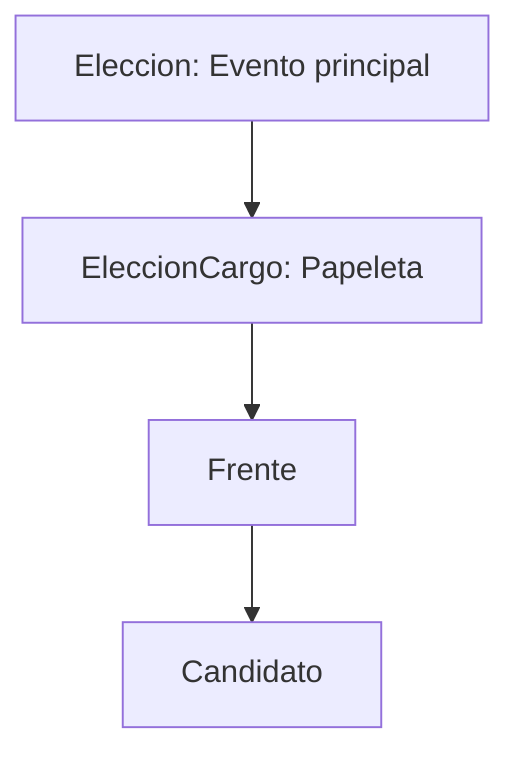
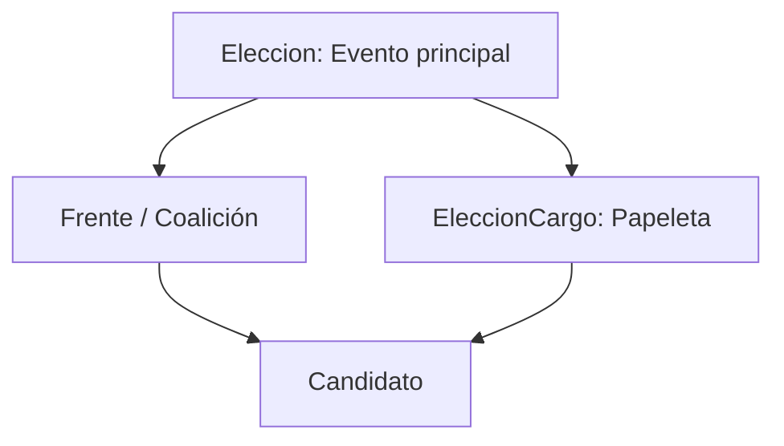

# Plan Frentes Y Candidatos Multialcance

## Diagnóstico

Modelo actual:



Modelo objetivo:



Hallazgos clave:

- [`frente.entity.ts`](SW2-grupal-backend/src/elecciones/entities/frente.entity.ts) hoy tiene FK obligatoria a `EleccionCargo`, por eso un frente queda atado a una papeleta.
- [`candidato.entity.ts`](SW2-grupal-backend/src/elecciones/entities/candidato.entity.ts) hoy solo tiene FK a `Frente`; no sabe directamente a qué papeleta postula.
- [`CandidatesSection.jsx`](SW2-grupal-frontend/src/pages/admin/partiesCandidates/CandidatesSection.jsx) elige primero `cargoId` y luego `frenteId`, pero el payload solo envía `frenteId`.
- [`CoalitionsSection.jsx`](SW2-grupal-frontend/src/pages/admin/partiesCandidates/CoalitionsSection.jsx) crea frentes usando `cargoId`, que en realidad es `eleccionCargoId`.
- La lógica de voto ya espera una papeleta (`eleccionCargoId`), por lo que el nuevo vínculo directo `Candidato.eleccionCargo` simplifica la validación.

## Backend

### 1. Evolución del esquema

Modificar entidades:

- [`Frente`](SW2-grupal-backend/src/elecciones/entities/frente.entity.ts):
  - Agregar `@ManyToOne(() => Eleccion)` como `eleccion`, obligatorio al final de la migración.
  - Mantener temporalmente `eleccionCargo` como nullable/deprecated para compatibilidad.
  - Conservar `candidatos[]`.
  - Revisar `esOpcionGlobal`: probablemente queda obsoleto; por ahora mantenerlo para no romper datos.

- [`Candidato`](SW2-grupal-backend/src/elecciones/entities/candidato.entity.ts):
  - Mantener `frente` obligatorio.
  - Agregar `@ManyToOne(() => EleccionCargo)` como `eleccionCargo`, obligatorio al final.
  - Recomendación de constraint futura: unique opcional `(eleccionCargo, ci)` si una misma persona no puede postular dos veces a la misma papeleta.

Crear migración incremental:

- `frente.eleccionId` nullable inicialmente.
- Backfill: `frente.eleccionId = frente.eleccionCargo.eleccionId`.
- `candidato.eleccionCargoId` nullable inicialmente.
- Backfill: `candidato.eleccionCargoId = candidato.frente.eleccionCargoId`.
- Validar filas huérfanas.
- Luego endurecer a `NOT NULL` si los datos están consistentes.

### 2. DTOs y endpoints de Frentes

Actualizar DTOs:

- [`crear-frente.dto.ts`](SW2-grupal-backend/src/elecciones/dto/frente/crear-frente.dto.ts): recibir `eleccionId` en el body o desde ruta.
- Dejar de recibir `eleccionCargoId` para crear un frente nuevo.

Endpoints recomendados:

- Nuevo: `POST /elecciones/:eleccionId/frentes`
- Nuevo: `GET /elecciones/:eleccionId/frentes`
- Mantener legacy temporal: `POST /elecciones/frente/:eleccionCargoId`, internamente derivando `eleccionId` desde la papeleta.
- `PATCH /elecciones/frente/:frenteId`: editar nombre, sigla, logo; no mover de elección salvo que sea estrictamente necesario.

Actualizar [`frente.service.ts`](SW2-grupal-backend/src/elecciones/services/frente.service.ts):

- Crear frentes contra `Eleccion`, no contra `EleccionCargo`.
- Listar frentes por `eleccionId`.
- En `listarFrentes()` global, devolver `eleccion` y no depender de `eleccionCargo`.

### 3. DTOs y endpoints de Candidatos

Actualizar [`crear-candidato.dto.ts`](SW2-grupal-backend/src/elecciones/dto/candidato/crear-candidato.dto.ts):

```ts
{
  ci: string;
  nombres: string;
  apellidos: string;
  fotoUrl?: string;
  frenteId: string;
  eleccionCargoId: string;
}
```

Validaciones del service:

- `frente` existe.
- `eleccionCargo` existe.
- `frente.eleccion.id === eleccionCargo.eleccion.id`.
- El candidato queda asociado a ambos: `frente` y `eleccionCargo`.

Endpoints recomendados:

- Mantener: `POST /elecciones/candidato`, pero exigir `eleccionCargoId`.
- Opcional más expresivo: `POST /elecciones/eleccion-cargo/:eleccionCargoId/candidato` con `frenteId` en body.
- `GET /elecciones/candidato/lista?eleccionId=...` para filtrar por proceso.
- `GET /elecciones/eleccion-cargo/:eleccionCargoId/candidatos` para listar por papeleta si se necesita.

Actualizar [`candidato.service.ts`](SW2-grupal-backend/src/elecciones/services/candidato.service.ts):

- Cargar relaciones `frente`, `frente.eleccion`, `eleccionCargo`, `eleccionCargo.cargo`, `eleccionCargo.eleccion`.
- En edición, permitir cambiar `frenteId` y `eleccionCargoId` solo si pertenecen a la misma elección.

### 4. Servicios dependientes

Actualizar servicios que hoy usan `candidato.frente.eleccionCargo`:

- [`voto.service.ts`](SW2-grupal-backend/src/elecciones/services/voto.service.ts): validar con `candidato.eleccionCargo.id === eleccionCargoId` directamente. Mantener `frente.id` para blockchain si el contrato sigue contando por frente dentro de papeleta.
- [`papeleta.service.ts`](SW2-grupal-backend/src/elecciones/services/papeleta.service.ts): cargar papeletas (`EleccionCargo`) y candidatos por `eleccionCargo`, agrupados por `frente`.
- [`escrutinio.service.ts`](SW2-grupal-backend/src/elecciones/services/escrutinio.service.ts): seguir calculando votos por `(eleccionCargoId, frenteId)`, pero obtener frentes desde la elección y candidatos desde la papeleta.
- Scripts como [`simular-votos.ts`](SW2-grupal-backend/scripts/simular-votos.ts): usar `candidato.eleccionCargo.id`.

## Frontend

### 1. Orquestador de Frentes y Candidatos

Actualizar [`GestionFrentesCandidatos.jsx`](SW2-grupal-frontend/src/pages/admin/electoral/GestionFrentesCandidatos.jsx):

- Agregar selector de `Elección / Proceso Electoral` arriba de la pantalla.
- Al seleccionar una elección, cargar:
  - Papeletas de esa elección (`EleccionCargo`) desde `fetchCargos()` filtrado o nuevo endpoint.
  - Frentes de esa elección.
  - Candidatos de esa elección.
- Evitar listados globales mezclados entre procesos.

### 2. Servicio API frontend

Actualizar [`electionsService.js`](SW2-grupal-frontend/src/services/electionsService.js):

- `fetchFrentes(eleccionId?)`
- `createFrente({ eleccionId, nombreFrente, sigla, logoUrl })`
- `fetchCandidates(eleccionId?)`
- `createCandidate({ ci, nombres, apellidos, frenteId, eleccionCargoId, fotoUrl })`
- `updateCandidate(candidateId, { ..., frenteId, eleccionCargoId })`
- Agregar helpers para etiquetar papeletas: `Rector y Vicerrector`, `Decano y Vicedecano - Facultad X`, `Director de Carrera - Carrera Y`.

### 3. Gestión de Frentes

Actualizar [`CoalitionsSection.jsx`](SW2-grupal-frontend/src/pages/admin/partiesCandidates/CoalitionsSection.jsx):

- Reemplazar selector actual de `Cargo` por selector de `Elección` recibido desde el padre o directamente no mostrarlo si el padre ya fija la elección.
- Crear frente con `eleccionId`, no con `eleccionCargoId`.
- Tabla: mostrar Frente, Sigla, Elección, Logo, Acciones.
- Mantener edición limitada a nombre/sigla/logo.

### 4. Gestión de Candidatos

Actualizar [`CandidatesSection.jsx`](SW2-grupal-frontend/src/pages/admin/partiesCandidates/CandidatesSection.jsx):

- Cambiar estado `cargoId` por `eleccionCargoId`.
- Formulario:
  - Select `Papeleta / Cargo` con todas las `EleccionCargo` del proceso seleccionado.
  - Select `Frente` con frentes de esa misma elección.
  - Datos personales y foto.
- Payload debe incluir `frenteId` y `eleccionCargoId`.
- Listado visual debe mostrar:
  - Frente.
  - Papeleta/cargo al que postula.
  - Ámbito: global, facultad o carrera.

Ejemplo de etiqueta visual:

- `Rector y Vicerrector - Global`
- `Decano y Vicedecano - Facultad de Ingeniería en Ciencias de la Computación`
- `Director de Carrera - Ingeniería Informática`

### 5. Validaciones UI

Actualizar [`shared.jsx`](SW2-grupal-frontend/src/pages/admin/partiesCandidates/shared.jsx):

- `validateCoalitionForm`: exigir `eleccionId`, nombre y sigla.
- `validateCandidateForm`: exigir `eleccionCargoId` y `frenteId`.
- Mensajes deben hablar de “papeleta” en vez de “cargo” cuando sea el caso.

## Compatibilidad y orden seguro

1. Agregar columnas nuevas y backfill en backend.
2. Actualizar services para leer preferentemente las relaciones nuevas, con fallback temporal a las viejas.
3. Actualizar frontend para enviar `eleccionId` en frentes y `eleccionCargoId` en candidatos.
4. Verificar voto, papeleta, escrutinio y simulación.
5. Cuando todo esté estable, retirar legacy:
   - `Frente.eleccionCargo`.
   - Endpoint `POST /elecciones/frente/:eleccionCargoId`.
   - Campos/props `cargoId` usados como alias de `eleccionCargoId`.

## Pruebas clave

- Crear un frente para una elección sin elegir papeleta.
- Crear candidato de ese frente para papeleta GLOBAL.
- Crear candidato del mismo frente para papeleta FACULTAD.
- Crear un frente local y postular candidato solo en papeleta CARRERA.
- Confirmar que el frontend lista claramente la papeleta del candidato.
- Confirmar que el backend rechaza candidato si `frente.eleccionId` no coincide con `eleccionCargo.eleccionId`.
- Confirmar que el voto sigue validando una papeleta específica y no mezcla candidatos de otra papeleta.