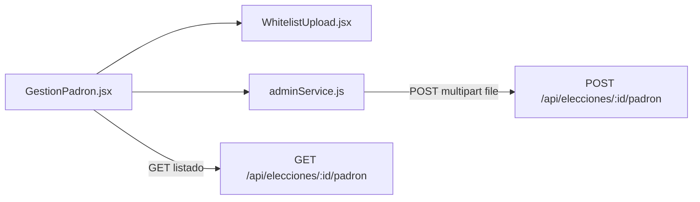
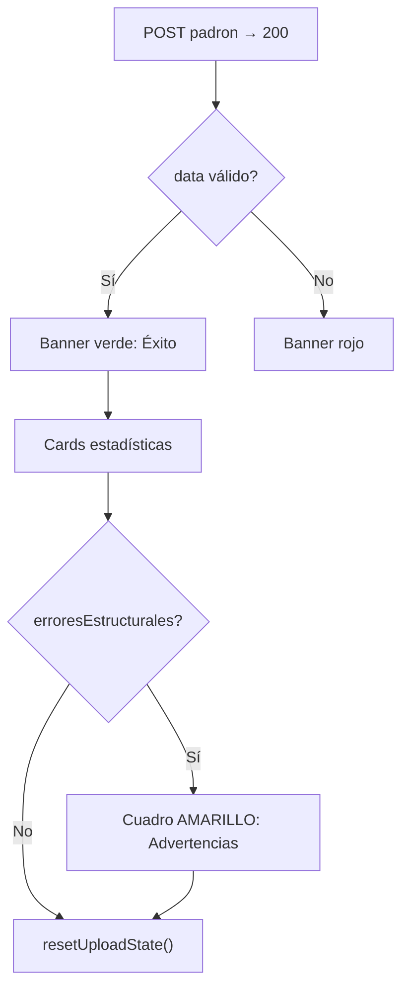

# Plan Frontend — Consumo de Carga del Padrón Electoral

## Diagnóstico del estado actual

El flujo **ya está conectado** al backend refactorizado:



| Pieza | Archivo | Estado |
|---|---|---|
| Pantalla admin | [`GestionPadron.jsx`](SW2-grupal-frontend/src/pages/admin/electoral/GestionPadron.jsx) | Funcional: selector de elección + upload + tabla |
| Upload UI | [`WhitelistUpload.jsx`](SW2-grupal-frontend/src/components/WhitelistUpload.jsx) | Funcional pero incompleto en feedback |
| API client | [`adminService.js`](SW2-grupal-frontend/src/services/adminService.js) | Funcional; sin tipos ni manejo fino de errores |
| Ruta | [`AppRoutes.jsx`](SW2-grupal-frontend/src/routes/AppRoutes.jsx) `/admin/padron` | Protegida con `AdminRoute` + rol `ELECTORAL` |

**Lo que ya funciona:** upload `.xlsx`, recarga del listado post-carga, filtros Estudiantes/Docentes, muestra parcial de `totalProcesado`, `electoresInsertados`, `electoresActualizados`.

**Brechas frente al backend actual:**

| Campo / comportamiento backend | Frontend hoy |
|---|---|
| `estudiantesProcesados`, `docentesProcesados` | No se muestran |
| `registrosHabilitados` | No se muestra |
| `erroresEstructurales` (fusiones dual-rol, advertencias) | No se muestran |
| Errores 400 multilínea (`message` del backend) | Mensaje genérico fijo |
| Formato Excel dual-sheet | Texto dice solo ".xlsx" |
| Columnas nuevas en listado (`facultad`, `lugarVotacion`, `habilitadoRector`, `registroDocente`) | No se muestran |
| `estaHabilitado` real | Siempre muestra "Habilitado" hardcodeado |

---

## Principios UX críticos (Corte Electoral)

Estas reglas son **obligatorias** en la implementación — evitan que el personal interprete mal una carga exitosa:

| Situación HTTP | UI | Color | Mensaje tipo |
|---|---|---|---|
| **200** + `data` válido | Éxito | Verde / azul institucional | "Padrón cargado correctamente" |
| **200** + `erroresEstructurales.length > 0` | Advertencias informativas | **Amarillo** (`border-amber-200`, `bg-amber-50`) | "Carga completada con advertencias" — **nunca rojo** |
| **400** / **500** / red | Error real | Rojo | Mensaje del backend (`response.data.message`) |

**Caso real de referencia** (padrón chiquitana):

```json
{
  "statusCode": 200,
  "data": {
    "totalProcesado": 939,
    "estudiantesProcesados": 924,
    "docentesProcesados": 16,
    "registrosHabilitados": 939,
    "erroresEstructurales": [
      "CI '4728253' fusionada (estudiante + docente): registro 981019986, cod. docente 7580."
    ]
  }
}
```

La Corte debe ver: **939 registros insertados + 1 advertencia amarilla**, no un error.



---

## 1. Capa de servicios (`adminService.js`)

**Archivo:** [`SW2-grupal-frontend/src/services/adminService.js`](SW2-grupal-frontend/src/services/adminService.js)

### 1.1 Documentar contratos con JSDoc

Añadir typedefs alineados con el backend:

```javascript
/**
 * @typedef {{
 *   totalProcesado: number,
 *   estudiantesProcesados: number,
 *   docentesProcesados: number,
 *   electoresInsertados: number,
 *   electoresActualizados: number,
 *   registrosHabilitados: number,
 *   erroresEstructurales: string[],
 * }} ResultadoCargaPadron
 */
```

Tipar retorno de `uploadWhitelistFile` como `Promise<ApiResponse<ResultadoCargaPadron>>`.

### 1.2 Ajustar upload multipart

Quitar el header manual `Content-Type: multipart/form-data` en `uploadWhitelistFile` (Axios debe setear el boundary automáticamente, igual que en biometría). Mantener solo `FormData` con campo `file`.

### 1.3 Helper de errores HTTP

Crear util compartida (ej. [`src/utils/apiErrors.js`](SW2-grupal-frontend/src/utils/apiErrors.js)):

```javascript
export function getApiErrorMessage(error, fallback) {
  return error?.response?.data?.message || fallback
}
```

Usar en `WhitelistUpload` para mostrar mensajes como cabeceras faltantes, duplicados o CI inválida tal como los devuelve NestJS.

### 1.4 Deprecar legacy

Marcar `uploadWhitelistArray` como `@deprecated` o eliminar si no hay referencias (endpoint `/estudiantes/whitelist` obsoleto).

---

## 2. Componente de carga (`WhitelistUpload.jsx`)

**Archivo:** [`SW2-grupal-frontend/src/components/WhitelistUpload.jsx`](SW2-grupal-frontend/src/components/WhitelistUpload.jsx)

### 2.1 Panel de instrucciones del formato Excel (sin descarga)

Bloque informativo encima del dropzone con:

**Hoja Estudiantes:** `Cod.Fac.` / `FAC`, `Facultad`, `Cod.lugar` / `Cod. Lugar`, `LUGAR DE VOTACION`, `CARR-PL`, `CARRERA`, `Registro`, `Nombre`, `CI`, `RECTOR`

**Hoja Docentes:** `Cod.Fac.`, `Facultad`, `Cod.Lugar`, `Lugar`, `Cod.Docente`, `Docente`, `C.I.`, `RECTOR`

Notas breves:
- Al menos una hoja debe existir
- CI acepta complemento (`7453385 SC`, `11341460-SCZ`)
- `RECTOR`: `SI` / `NO`
- Docente que también estudia puede aparecer en ambas hojas (se fusiona automáticamente)

### 2.2 Panel de resultado: Cards estadísticas (post-carga exitosa)

Tras HTTP **200**, mostrar un bloque de **tarjetas (Cards)** destacadas — no solo texto en una línea. Diseño sugerido en grid responsive (`grid-cols-1 sm:grid-cols-3`):

| Card | Campo backend | Ejemplo UI |
|---|---|---|
| Estudiantes cargados | `estudiantesProcesados` | "924" + subtítulo "Estudiantes" |
| Docentes cargados | `docentesProcesados` | "16" + subtítulo "Docentes" |
| Total habilitados | `registrosHabilitados` | "939" + subtítulo "Habilitados en esta elección" |

Cards secundarias (fila inferior o texto más pequeño):
- `totalProcesado`, `electoresInsertados`, `electoresActualizados`

**Componente sugerido:** extraer `PadronUploadSummary.jsx` con props `{ data: ResultadoCargaPadron }` para reutilizar en `WhitelistUpload` y, si aplica, en `GestionPadron` (resumen persistente).

Estilo éxito: borde verde suave + icono check. Las cards de totales usan fondo blanco/slate con número grande (`text-2xl font-bold`).

### 2.3 Advertencias (`erroresEstructurales`) — reglas estrictas

**Separación visual obligatoria** del bloque de éxito:

1. Banner verde arriba: *"Padrón cargado correctamente"* + cards de totales.
2. **Debajo**, solo si `erroresEstructurales.length > 0`:
   - Cuadro **amarillo** con título: *"Advertencias (la carga se completó correctamente)"*
   - Lista `<ul>` con cada string del array
   - Texto aclaratorio: *"Estas observaciones no impiden la carga. Revise los casos indicados si lo considera necesario."*

**Prohibido:**
- Usar `border-red-*`, `bg-red-*` o iconos de error para `erroresEstructurales`
- Mezclar advertencias dentro del mismo contenedor rojo de errores HTTP
- Usar la palabra "Error" en el título del cuadro amarillo

Ejemplo de fusión dual-rol a mostrar tal cual viene del backend:
> CI '4728253' fusionada (estudiante + docente): registro 981019986, cod. docente 7580.

### 2.4 Reinicio del componente tras carga exitosa

Incluir función explícita `resetUploadState()` llamada **solo** cuando `statusCode === 200`:

```javascript
function resetUploadState() {
  setFile(null)
  setErrorMessage('')
  if (inputRef.current) inputRef.current.value = ''
}
```

Comportamiento esperado:
- Limpiar archivo seleccionado y label "Archivo seleccionado: Ninguno"
- Mantener visible el panel de éxito + cards + advertencias (no borrar `result`)
- Botón "Cargar padrón" deshabilitado hasta nueva selección
- Permite subir otro Excel (otro recinto/elección) sin recargar la página

**Nota:** `WhitelistUpload.jsx` ya limpia parcialmente el file en éxito; formalizar en `resetUploadState()` y documentar que **no** debe limpiar `result` ni las advertencias.

### 2.5 Errores de validación HTTP (400/500) — solo rojo aquí

En `catch`:
- Usar `getApiErrorMessage(err, '...')`
- Si `message` contiene `\n`, renderizar como lista (`split('\n')`) para legibilidad en Postman-like errors

---

## 3. Pantalla de gestión (`GestionPadron.jsx`)

**Archivo:** [`SW2-grupal-frontend/src/pages/admin/electoral/GestionPadron.jsx`](SW2-grupal-frontend/src/pages/admin/electoral/GestionPadron.jsx)

### 3.1 Deshabilitar upload sin elección

`WhitelistUpload` solo se renderiza si hay `selectedElectionId` (ya condicionado). Añadir guard visual: si no hay elecciones creadas, CTA a `/admin/gestion-eleccion`.

### 3.2 Resumen post-carga persistente (opcional)

Elevar el último `ResultadoCargaPadron` a estado local en `GestionPadron` (callback `onUploadSuccess`) para que el resumen permanezca visible aunque el usuario haga scroll al listado.

### 3.3 Ampliar tabla del listado

Columnas actuales + nuevas:

| Columna | Fuente |
|---|---|
| Registro | `row.elector.registro` |
| Cod. Docente | `row.elector.registroDocente` (mostrar `—` si null) |
| CI | `row.elector.ci` |
| Apellidos y Nombres | `apellido nombre` |
| Estamento | badge existente |
| Facultad | `row.elector.facultad` |
| Carrera | `row.elector.carrera` |
| Lugar de votación | `row.lugarVotacion` |
| Rector | `row.habilitadoRector` → badge SI/NO |
| Estado | `row.estaHabilitado` → Habilitado / Inhabilitado (no hardcodear) |

Ajustar `colSpan` en estados vacíos/carga.

### 3.4 Paginación (mejora incremental)

Hoy se pide `limit=500` fijo. Para padrones grandes (>500):
- Leer `metadata.pagination.total` (ya correcto: backend expone `metadata.pagination.total`)
- Añadir controles página siguiente/anterior o aumentar límite a 1000 con aviso

Prioridad baja si el padrón chiquitana (~939) cabe en una página.

### 3.5 Contadores en cabecera del listado

Mostrar desglose cuando no hay filtro de estamento:
- Total / Estudiantes / Docentes (derivado del filtro activo + total paginado, o contadores locales tras carga usando `ResultadoCargaPadron`)

---

## 4. Flujos downstream del votante (alcance acotado)

Estos cambios **no bloquean** la carga admin pero completan el circuito del padrón:

### 4.1 Papeleta con filtro Rector

Backend ya soporta `GET /elecciones/:id/papeleta?registro=...`.

En [`electionsService.js`](SW2-grupal-frontend/src/services/electionsService.js):

```javascript
export async function fetchBallotComplete(electionId, registro) {
  const params = registro ? { registro } : {}
  const response = await api.get(`/elecciones/${electionId}/papeleta`, { params })
  return response?.data
}
```

En [`VotingBallot.jsx`](SW2-grupal-frontend/src/pages/VotingBallot.jsx): pasar `registro` del JWT (`decodeJwtPayload(token).registro`) al cargar papeleta, para ocultar cargo Rector si `habilitadoRector = false`.

### 4.2 Login con Cod.Docente

Backend ya busca por `registro` **o** `registroDocente`. Verificar que el formulario de login no restrinja formato (solo numérico) y que mensajes de error sean claros para docentes dual-rol.

---

## 5. Limpieza de código legacy

| Archivo | Acción |
|---|---|
| [`AdminDashboard.jsx`](SW2-grupal-frontend/src/pages/AdminDashboard.jsx) | Eliminar o redirigir a `/admin/padron` — usa `uploadWhitelistFile` sin `eleccionId` y no está enrutado |
| [`ResumenAdmin.jsx`](SW2-grupal-frontend/src/pages/admin/compartido/ResumenAdmin.jsx) | Opcional: cambiar métrica "Padrón" de `/estudiantes/total` a conteo del padrón de elección activa |

---

## 6. Plan de implementación secuencial

### Paso 1 — Servicios
- JSDoc `ResultadoCargaPadron` en `adminService.js`
- Fix multipart headers
- Util `getApiErrorMessage`

### Paso 2 — WhitelistUpload + PadronUploadSummary (UX prioritario)
- Bloque de instrucciones Excel dual-sheet
- **`PadronUploadSummary`**: 3 cards principales (Estudiantes / Docentes / Total habilitados)
- Banner verde de éxito + cuadro **amarillo** separado para `erroresEstructurales` (nunca rojo)
- `resetUploadState()` tras HTTP 200
- Errores HTTP 400/500 en rojo con mensaje del backend

### Paso 3 — GestionPadron
- Tabla ampliada con campos nuevos del backend
- Estado real `estaHabilitado`
- Resumen post-carga persistente (opcional)

### Paso 4 — Votante (opcional pero recomendado)
- `fetchBallotComplete(electionId, registro)` + uso en `VotingBallot`

### Paso 5 — Limpieza
- Remover `AdminDashboard` huérfano

### Paso 6 — Pruebas manuales

Checklist con los Excel reales en [`Datos de prueba/`](Datos de prueba/):

1. Cargar `Padron_Sintetico_Completo_UAGRM.xlsx` → 1050 procesados, 0 advertencias
2. Cargar `padron chiquitana...` → cards 924 / 16 / 939 + **1 cuadro amarillo** (no rojo) con fusión CI 4728253
3. Forzar error (Excel sin hojas válidas) → mensaje del backend visible, no genérico
4. Re-cargar mismo archivo → `electoresActualizados > 0`, `electoresInsertados = 0`
5. Verificar listado: facultad, lugar, Rector, registro docente en fila fusionada
6. Login docente dual-rol con Cod.Docente `7580` y con registro `981019986`
7. Papeleta: elector sin Rector no ve cargo Rector (si se implementa paso 4)

---

## Archivos principales a modificar

| Archivo | Cambio |
|---|---|
| [`adminService.js`](SW2-grupal-frontend/src/services/adminService.js) | Tipos, fix multipart, deprecar legacy |
| [`WhitelistUpload.jsx`](SW2-grupal-frontend/src/components/WhitelistUpload.jsx) | Instrucciones, cards, advertencias amarillas, reset input |
| [`PadronUploadSummary.jsx`](SW2-grupal-frontend/src/components/PadronUploadSummary.jsx) | **Nuevo** — cards estadísticas reutilizables |
| [`GestionPadron.jsx`](SW2-grupal-frontend/src/pages/admin/electoral/GestionPadron.jsx) | Tabla enriquecida, UX vacíos |
| [`apiErrors.js`](SW2-grupal-frontend/src/utils/apiErrors.js) | Nuevo helper |
| [`electionsService.js`](SW2-grupal-frontend/src/services/electionsService.js) | Query `registro` en papeleta (opcional) |
| [`VotingBallot.jsx`](SW2-grupal-frontend/src/pages/VotingBallot.jsx) | Pasar registro a papeleta (opcional) |

**Fuera de alcance inmediato:** descarga de plantilla Excel desde UI (según tu preferencia: solo instrucciones en pantalla), paginación server-side avanzada, edición inline de `estaHabilitado` (backend `toggleHabilitacionElector` aún no implementado).
