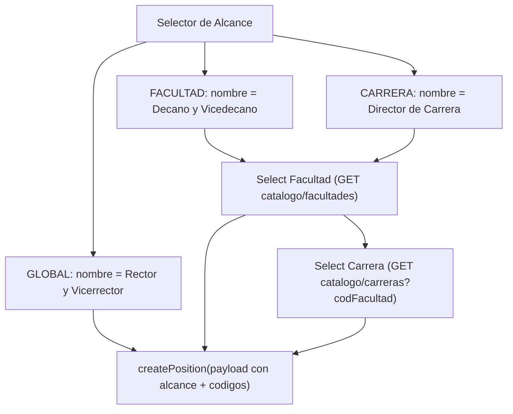

## Contexto y hallazgos

- La gestión electoral vive en [GestionElecciones.jsx](SW2-grupal-frontend/src/pages/admin/electoral/GestionElecciones.jsx) con **formularios inline** (no modales). El form de cargo solo maneja `{ name, faculty, electionId }`.
- El servicio API es [electionsService.js](SW2-grupal-frontend/src/services/electionsService.js); `createPosition` hace `POST /elecciones/cargo`.
- **No existe catálogo de facultades/carreras** en el frontend ni endpoint en el backend. Los datos `codFacultad`, `facultad`, `codCarrera`, `carrera` viven en cada `Elector` del padrón.
- El backend ya acepta el payload nuevo: [crear-cargo.dto.ts](SW2-grupal-backend/src/elecciones/dto/cargo/crear-cargo.dto.ts) exige `alcance` y condicionalmente `codFacultad`/`codCarrera`.
- `GET /elecciones/cargo/lista` ya devuelve `alcance`, `codFacultad`, `facultadNombre`, `codCarrera`, `carreraNombre` por papeleta.

Decisión confirmada: el catálogo se **deriva del padrón** del proceso, y el plan **incluye el endpoint backend**.

## Flujo objetivo



## Backend: endpoint de catálogo

En [padron.service.ts](SW2-grupal-backend/src/elecciones/services/padron.service.ts) agregar dos métodos que consultan `PadronElectoral` → `Elector` con `DISTINCT`:
- `obtenerFacultadesDePadron(eleccionId)` → `[{ codFacultad, facultadNombre }]` (electores habilitados del proceso).
- `obtenerCarrerasDePadron(eleccionId, codFacultad)` → `[{ codCarrera, carreraNombre }]` filtrado por `codFacultad` y `estamento = ESTUDIANTE` (solo estudiantes tienen carrera).

En [elecciones.controller.ts](SW2-grupal-backend/src/elecciones/controllers/elecciones.controller.ts) exponer:
- `GET /elecciones/:eleccionId/catalogo/facultades`
- `GET /elecciones/:eleccionId/catalogo/carreras?codFacultad=...`

Devolver vía `createApiResponse` para mantener el formato `{ data }`.

## Frontend: servicio API

En [electionsService.js](SW2-grupal-frontend/src/services/electionsService.js):
- Agregar `fetchFacultadesPadron(eleccionId)` y `fetchCarrerasPadron(eleccionId, codFacultad)`.
- Modificar `createPosition` / `updatePosition` para enviar el payload extendido:

```js
{
  nombre, eleccionId, alcance,        // 'GLOBAL' | 'FACULTAD' | 'CARRERA'
  codFacultad, facultadNombre,        // si FACULTAD o CARRERA
  codCarrera, carreraNombre,          // si CARRERA
}
```

- Añadir un `typedef` `AlcancePapeleta` y constantes con los nombres por defecto del cargo.

## Frontend: componente nuevo `PapeletaForm.jsx`

Extraer el form inline de cargo de `GestionElecciones.jsx` a un componente nuevo `src/pages/admin/electoral/PapeletaForm.jsx` (formulario dinámico reutilizable para crear/editar). Responsabilidades:
- Selector de **Alcance** (`GLOBAL`/`FACULTAD`/`CARRERA`).
- Auto-completar `nombre` del cargo según alcance: `Rector y Vicerrector`, `Decano y Vicedecano`, `Director de Carrera` (editable).
- Render condicional de selectores dependientes.
- Cargar facultades cuando alcance ∈ {FACULTAD, CARRERA} y haya elección seleccionada.
- Cargar carreras al elegir facultad (solo si CARRERA); resetear carrera si cambia la facultad.
- Al elegir facultad/carrera, guardar también el nombre (`facultadNombre`/`carreraNombre`) para el snapshot.
- Validación: bloquear submit si falta `codFacultad` (FACULTAD/CARRERA) o `codCarrera` (CARRERA).

Estado del formulario (en `GestionElecciones.jsx` o local al componente):

```js
positionForm = {
  electionId, alcance, name,
  codFacultad, facultadNombre,
  codCarrera, carreraNombre,
}
// + estados auxiliares: facultades, carreras, isLoadingFacultades, isLoadingCarreras
```

## Frontend: `GestionElecciones.jsx`

- Reemplazar el bloque inline del form de cargo por `<PapeletaForm ... />`.
- Ampliar `positionForm` con los campos de alcance/códigos y resetearlos al cambiar de alcance o de elección.
- En la **tabla de cargos**, mostrar columnas nuevas: Alcance y Ámbito (Facultad/Carrera) usando los campos que ya devuelve `fetchCargos()` (`alcance`, `facultadNombre`, `carreraNombre`).
- En modo edición, precargar alcance y códigos desde la papeleta seleccionada.

## Consideración de consistencia

`CoalitionsSection` usa `position.eleccionCargoId` y `CandidatesSection`/`GestionElecciones` usan `position.id`. No es bloqueante para este plan (frentes/candidatos siguen ligados al cargo), pero se documenta para evitar confusión al mostrar el ámbito de cada papeleta.

## Pruebas manuales

- Crear papeleta GLOBAL → nombre por defecto "Rector y Vicerrector", sin selectores extra.
- Crear papeleta FACULTAD → aparece selector de Facultad poblado desde el padrón; payload con `codFacultad` + `facultadNombre`.
- Crear papeleta CARRERA → selector Facultad y luego Carrera dependiente; payload con `codCarrera` + `carreraNombre`.
- Cambiar de facultad resetea la carrera.
- Verificar que el `codFacultad`/`codCarrera` enviado coincide con el de los electores (filtrado por alcance en voto/papeleta funciona).