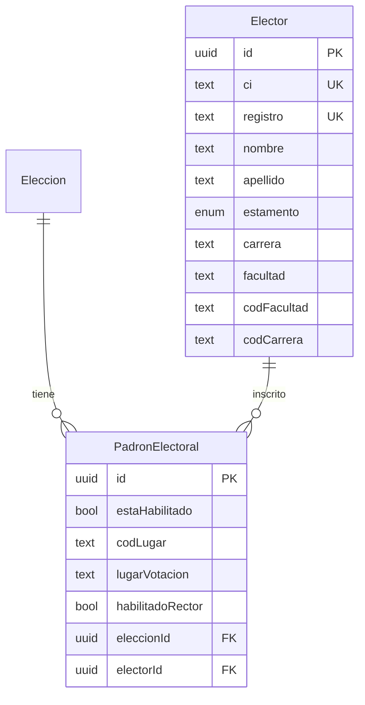

# Plan de Refactorización — Carga del Padrón Electoral (Formato Excel Dual)

## 1. Análisis del Estado Actual

### Arquitectura vigente

El flujo actual está centralizado en [`padron.service.ts`](SW2-grupal-backend/src/elecciones/services/padron.service.ts) y expuesto vía `POST /api/elecciones/:eleccionId/padron` en [`elecciones.controller.ts`](SW2-grupal-backend/src/elecciones/controllers/elecciones.controller.ts).


**Modelo de datos actual (dos capas):**

| Tabla | Rol | Campos clave |
|---|---|---|
| [`electores`](SW2-grupal-backend/src/electores/entities/elector.entity.ts) | Catálogo global de identidad | `ci`, `registro`, `nombre`, `apellido`, `estamento`, `carrera` |
| [`padron_electoral`](SW2-grupal-backend/src/elecciones/entities/padron-electoral.entity.ts) | Whitelist por elección | `eleccion`, `elector`, `estaHabilitado` |

### Formato Excel que espera hoy

- **Una sola hoja** (la primera del workbook).
- Columnas obligatorias: `registro`, `ci`, `nombre`, `apellido`, `carrera`.
- Columna opcional: `estamento` (`ESTUDIANTE` / `DOCENTE`; default `ESTUDIANTE`).
- Librería: **`xlsx` (SheetJS) v0.18.5** — no hay `exceljs` en el proyecto.

### Limitaciones frente al nuevo Excel

| Aspecto | Estado actual | Nuevo formato |
|---|---|---|
| Hojas | Solo hoja 1 | Hojas **Estudiantes** y **Docentes** con esquemas distintos |
| Identificador | Siempre `registro` | Estudiantes: `Registro`; Docentes: `Cod.Docente` |
| Nombre | `nombre` + `apellido` separados | Una sola columna: `Nombre` / `Docente` |
| Carrera | Obligatoria para todos | Solo estudiantes (`CARRERA`); docentes solo tienen `Facultad` |
| Facultad / lugar | No existen | `Cod.Fac.`, `Facultad`, `Cod.lugar`, `LUGAR DE VOTACION` |
| Voto Rector | No existe | Columna `RECTOR` (flag de elegibilidad) |
| Estamento | Columna explícita o default | **Inferido por la hoja** de origen |

### Dependencias downstream a considerar

- **Biometría** ([`biometria.service.ts`](SW2-grupal-backend/src/biometria/biometria.service.ts)): compara `elector.nombre` y `elector.apellido` por separado contra OCR del carnet. El nuevo Excel trae nombre completo → **requiere estrategia de split al cargar**.
- **Login / voto**: buscan por `registro` (estudiantes) o `Cod.Docente` mapeado a `registro` (docentes). Sin cambios en auth si se normaliza en carga.
- **Estadísticas** ([`estadisticas.service.ts`](SW2-grupal-backend/src/elecciones/services/estadisticas.service.ts)): agrupa estudiantes por `carrera`; docentes por estamento. Docentes deben tener `facultad` o equivalente mapeado.
- **Certificado** ([`certificado.service.ts`](SW2-grupal-backend/src/elecciones/services/certificado.service.ts)): imprime `elector.carrera` como "CARRERA / FACULTAD".

---

## 2. Actualización de Modelos / Esquemas

### 2.1 Entidad `Elector` — catálogo global (identidad estable)

**Campos a agregar:**

| Campo | Tipo | Estudiantes | Docentes | Notas |
|---|---|---|---|---|
| `facultad` | `text`, NOT NULL | Desde columna `Facultad` | Desde columna `Facultad` | Unifica estamento |
| `codFacultad` | `text`, nullable | Desde `Cod.Fac.` | Desde `Cod.Fac.` | Código institucional |
| `codCarrera` | `text`, nullable | Desde `CARR-PL` | `null` | Solo estudiantes |

**Campos existentes — reglas de mapeo:**

| Campo | Estudiantes | Docentes |
|---|---|---|
| `registro` | `Registro` | `Cod.Docente` |
| `ci` | `CI` | `C.I.` |
| `nombre` / `apellido` | Split heurístico de `Nombre` | Split heurístico de `Docente` |
| `estamento` | `ESTUDIANTE` (fijo por hoja) | `DOCENTE` (fijo por hoja) |
| `carrera` | Columna `CARRERA` | Usar valor de `Facultad` como fallback semántico **o** dejar vacío/`N/A` y confiar en `facultad` |

**Recomendación:** mantener `carrera` NOT NULL por compatibilidad; para docentes asignar `carrera = facultad` (mismo valor). Esto evita tocar certificados y estadísticas existentes.

### 2.2 Entidad `PadronElectoral` — metadata por elección

Según tu decisión, el lugar de votación y la elegibilidad para Rector son **específicos del comicio**:

| Campo nuevo | Tipo | Origen Excel | Descripción |
|---|---|---|---|
| `codLugar` | `text`, nullable | `Cod.lugar` / `Cod.Lugar` | Código del recinto |
| `lugarVotacion` | `text`, nullable | `LUGAR DE VOTACION` / `Lugar` | Nombre del recinto |
| `habilitadoRector` | `boolean`, default `false` | `RECTOR` | Flag: puede votar por cargo Rector |

`estaHabilitado` existente sigue representando si el votante puede participar en la elección en general.

### 2.3 Migración de esquema

Hoy el proyecto usa `synchronize: true` en [`app.module.ts`](SW2-grupal-backend/src/app.module.ts). Para producción se recomienda:

1. Crear migración TypeORM explícita (ej. `AddPadronMetadataColumns`) en lugar de depender solo de auto-sync.
2. Backfill opcional: registros existentes en `padron_electoral` → `habilitadoRector = false`, `codLugar/lugarVotacion = null`.

### 2.4 Diagrama del modelo objetivo



---

## 3. Estrategia de Extracción de Datos

### 3.1 Refactor estructural del parser

Extraer la lógica de [`parseExcelBuffer`](SW2-grupal-backend/src/elecciones/services/padron.service.ts) a un módulo dedicado, por ejemplo:

```
src/elecciones/services/padron/
  padron-excel.parser.ts      # Orquestador de las 2 hojas
  padron-excel.schemas.ts     # Definición de columnas por hoja
  padron-excel.mapper.ts      # Mapeo fila → modelo interno
  padron-name-splitter.ts     # Split Nombre/Docente → nombre + apellido
```

**Mantener `xlsx`** — ya está instalada y es suficiente para leer hojas por nombre:

```typescript
// Pseudocódigo — no implementar aún
const wb = XLSX.read(buffer, { type: 'buffer' });
const hojaEst = wb.Sheets['Estudiantes'] ?? wb.Sheets[findByAlias('estudiantes')];
const hojaDoc = wb.Sheets['Docentes'] ?? wb.Sheets[findByAlias('docentes')];
```

### 3.2 Esquemas de columnas por hoja

**Hoja ESTUDIANTES** — cabeceras exactas (case-insensitive + trim):

| Excel | Campo interno | Obligatorio |
|---|---|---|
| `Cod.Fac.` | `codFacultad` | Sí |
| `Facultad` | `facultad` | Sí |
| `Cod.lugar` | `codLugar` | Sí |
| `LUGAR DE VOTACION` | `lugarVotacion` | Sí |
| `CARR-PL` | `codCarrera` | Sí |
| `CARRERA` | `carrera` | Sí |
| `Registro` | `registro` | Sí |
| `Nombre` | `nombreCompleto` → split | Sí |
| `CI` | `ci` | Sí |
| `RECTOR` | `habilitadoRector` | Sí |

**Hoja DOCENTES:**

| Excel | Campo interno | Obligatorio |
|---|---|---|
| `Cod.Fac.` | `codFacultad` | Sí |
| `Facultad` | `facultad` | Sí |
| `Cod.Lugar` | `codLugar` | Sí |
| `Lugar` | `lugarVotacion` | Sí |
| `Cod.Docente` | `registro` | Sí |
| `Docente` | `nombreCompleto` → split | Sí |
| `C.I.` | `ci` | Sí |
| `RECTOR` | `habilitadoRector` | Sí |

Cada fila parseada incluirá metadatos: `__sheetName`, `__rowNumber`, `__estamento`.

### 3.3 Normalización de cabeceras

Reutilizar el patrón actual de aliases, pero **por hoja**:

- Normalizar: `trim().toLowerCase().replace(/\s+/g, ' ')`.
- Mapa de aliases tolerante a variaciones menores (`cod.fac.`, `cod fac`, `c.i.`).
- Validación estricta: si falta una columna obligatoria en una hoja → `BadRequestException` indicando hoja y columnas faltantes.

### 3.4 Validación de datos entrantes

**Nivel 1 — Estructural (por hoja, acumula errores parciales como hoy):**
- Archivo con al menos una hoja válida (`Estudiantes` y/o `Docentes`).
- Cabeceras completas por hoja presente.
- Filas vacías omitidas.
- Campos obligatorios no vacíos.

**Nivel 2 — Formato de valores:**
- `registro` / `Cod.Docente`: solo dígitos (regex `/^\d+$/`), sin espacios.
- `ci`: normalizar (quitar puntos/guiones), validar longitud razonable (6–10 dígitos).
- `RECTOR`: parsear variantes (`SI`/`NO`, `1`/`0`, `TRUE`/`FALSE`, `S`/`N`) → boolean.
- `codFacultad`, `codLugar`, `codCarrera`: validar no vacío y formato alfanumérico.

**Nivel 3 — Duplicados internos (archivo completo):**
- Unificar filas de ambas hojas antes de validar.
- Rechazar duplicados de `registro` o `ci` **entre hojas y dentro de cada hoja** (reutilizar `validateNoDuplicates` extendido con referencia a hoja).

**Nivel 4 — Colisiones cruzadas registro ↔ CI:**
- Mantener la lógica existente en Fase A de la transacción.

**Nivel 5 — Split de nombre completo:**
- Heurística recomendada (formato boliviano típico: `APELLIDO_PATERNO APELLIDO_MATERNO NOMBRE(S)`):
  - Si hay ≥ 3 tokens: últimos 1–2 tokens → `nombre`, resto → `apellido`.
  - Si hay 2 tokens: primero → `apellido`, segundo → `nombre`.
  - Si hay 1 token: `nombre = token`, `apellido = '-'` (fallback documentado).
- Registrar en `erroresEstructurales` filas con nombre de un solo token para revisión manual.

### 3.5 Interfaz interna unificada post-parseo

```typescript
interface FilaPadronNormalizada {
  registro: string;
  ci: string;
  nombre: string;
  apellido: string;
  estamento: EstamentoEnum;
  carrera: string;
  facultad: string;
  codFacultad: string;
  codCarrera?: string;
  codLugar: string;
  lugarVotacion: string;
  habilitadoRector: boolean;
  __sheetName: string;
  __rowNumber: number;
}
```

El resto del pipeline (`cargarPadronElectoral`) consume esta interfaz unificada.

### 3.6 Respuesta enriquecida (opcional, recomendada)

Extender `ResultadoCargaPadron`:

```typescript
{
  totalProcesado: number;
  estudiantesProcesados: number;
  docentesProcesados: number;
  electoresInsertados: number;
  electoresActualizados: number;
  registrosHabilitados: number;
  erroresEstructurales: string[];  // incluir "Hoja Docentes, Fila 12: ..."
}
```

---

## 4. Estrategia de Inserción (Performance)

### 4.1 Mantener el patrón actual (recomendado)

La estrategia vigente es sólida y debe **preservarse**:

1. **Una transacción atómica** (`dataSource.transaction`).
2. **Fase A** — `electorRepo.upsert(..., { conflictPaths: ['registro'] })`.
3. **Fase B** — recuperar UUIDs + `padronRepo.upsert(..., { conflictPaths: ['eleccion', 'elector'] })`.

Ventajas: idempotencia, manejo de re-cargas, rollback completo ante error.

### 4.2 Ajustes para el nuevo modelo

**Fase A — `electores`:**
- Mapear campos nuevos (`facultad`, `codFacultad`, `codCarrera`) en el upsert.
- Upsert sigue keyed por `registro` (estudiantes y docentes conviven sin colisión si sus códigos son únicos institucionalmente).

**Fase B — `padron_electoral`:**
- Incluir `codLugar`, `lugarVotacion`, `habilitadoRector` en cada entidad antes del upsert.
- El upsert por `(eleccion, elector)` **actualizará** metadata de lugar y flag Rector en re-cargas.

### 4.3 Optimizaciones opcionales (solo si el padrón supera ~10k filas)

| Técnica | Cuándo | Notas |
|---|---|---|
| Batch upsert en chunks de 500–1000 | Latencia alta en upsert masivo | Dividir arrays antes de `upsert` |
| Precarga única de existentes | Ya implementada parcialmente | Extender select a nuevos campos |
| Índices | Post-migración | Índice en `padron_electoral(eleccionId, habilitadoRector)` si se filtra por Rector |

**No migrar a SQL raw / COPY** salvo profiling que demuestre cuello de botella; TypeORM upsert es adecuado para el volumen universitario típico.

### 4.4 Prevención de duplicados — resumen

| Capa | Mecanismo |
|---|---|
| Archivo | `validateNoDuplicates` cross-sheet |
| Aplicación | Colisión CI ↔ registro pre-upsert |
| BD | `UNIQUE(ci)`, `UNIQUE(registro)` en `electores`; `UNIQUE(eleccion, elector)` en `padron_electoral` |
| Postgres | Catch `23505` → mensaje amigable (ya implementado) |

---

## 5. Plan de Acción (To-Do List)

### Paso 1 — Diseño y contratos
- Documentar el mapeo hoja → modelo interno (este plan).
- Acordar valores aceptados de columna `RECTOR` (`SI`/`NO`, etc.).
- Definir si ambas hojas son obligatorias o se permite cargar solo una.

### Paso 2 — Migración de base de datos
- Extender [`elector.entity.ts`](SW2-grupal-backend/src/electores/entities/elector.entity.ts): `facultad`, `codFacultad`, `codCarrera`.
- Extender [`padron-electoral.entity.ts`](SW2-grupal-backend/src/elecciones/entities/padron-electoral.entity.ts): `codLugar`, `lugarVotacion`, `habilitadoRector`.
- Crear migración TypeORM explícita.

### Paso 3 — Extraer parser Excel
- Crear `padron-excel.schemas.ts` con columnas obligatorias por hoja.
- Crear `padron-name-splitter.ts` con heurística de split + tests unitarios.
- Crear `padron-excel.parser.ts`: lee ambas hojas, valida cabeceras, produce `FilaPadronNormalizada[]`.

### Paso 4 — Refactorizar `PadronService`
- Reemplazar `parseExcelBuffer` monolítico por el nuevo parser.
- Actualizar interfaces (`ElectorExcelRow` → `FilaPadronNormalizada`).
- Extender `validateNoDuplicates` para incluir nombre de hoja en mensajes.
- Actualizar Fase A y Fase B del upsert con campos nuevos.

### Paso 5 — Actualizar respuesta y listado
- Enriquecer `ResultadoCargaPadron` con contadores por estamento.
- Opcional: incluir `lugarVotacion` y `habilitadoRector` en `listarPadronElectoral`.

### Paso 6 — Ajustes downstream (mínimos)
- Verificar biometría con nombres split desde Excel real (muestra de 5–10 registros).
- Verificar certificado: docentes mostrarán facultad vía `carrera = facultad`.
- Si el flujo de voto a Rector existe o se planea: filtrar por `habilitadoRector` al construir papeleta de ese cargo.

### Paso 7 — Endurecer endpoint de carga
- Validar que `file` exista antes de acceder a `file.buffer`.
- Validar extensión/MIME `.xlsx`.
- (Opcional) Agregar guard de rol administrador.

### Paso 8 — Pruebas
- Tests unitarios: parser por hoja, split de nombres, parseo de RECTOR, duplicados cross-sheet.
- Test de integración: carga completa → verificar conteos en `electores` y `padron_electoral`.
- Test de re-carga idempotente (mismo archivo dos veces).

### Paso 9 — Documentación y frontend
- Actualizar [`Documentacion.md`](SW2-grupal-backend/Documentacion.md) / HU-001 con nuevo formato de plantilla.
- Coordinar con frontend la plantilla Excel de ejemplo con dos hojas.

---

## Riesgos y mitigaciones

| Riesgo | Mitigación |
|---|---|
| Split incorrecto de nombres rompe biometría | Tests con datos reales anonimizados; fallback conservador; log de filas con 1 token |
| Colisión `Registro` estudiante vs `Cod.Docente` | Validación cross-sheet + constraints UNIQUE en BD |
| Hojas con nombres distintos (`ESTUDIANTES` vs `Estudiantes`) | Búsqueda case-insensitive + alias |
| `synchronize: true` en prod | Migración explícita antes del deploy |
| Columna RECTOR con valores no estandarizados | Tabla de mapeo explícita + error descriptivo por fila |

---

## Archivos principales a modificar

| Archivo | Cambio |
|---|---|
| [`padron.service.ts`](SW2-grupal-backend/src/elecciones/services/padron.service.ts) | Orquestación, upsert extendido |
| [`elector.entity.ts`](SW2-grupal-backend/src/electores/entities/elector.entity.ts) | Nuevos campos facultad/códigos |
| [`padron-electoral.entity.ts`](SW2-grupal-backend/src/elecciones/entities/padron-electoral.entity.ts) | Lugar votación + flag Rector |
| Nuevo: `padron-excel.parser.ts` y auxiliares | Parsing dual-sheet |
| Nuevo: migración TypeORM | Esquema BD |
| Tests nuevos bajo `src/elecciones/services/padron/` | Cobertura del parser |

**Fuera de alcance inmediato** (no bloquean la carga): toggle de habilitación individual (`toggleHabilitacionElector` — aún sin implementar), cambio de librería a `exceljs`.
