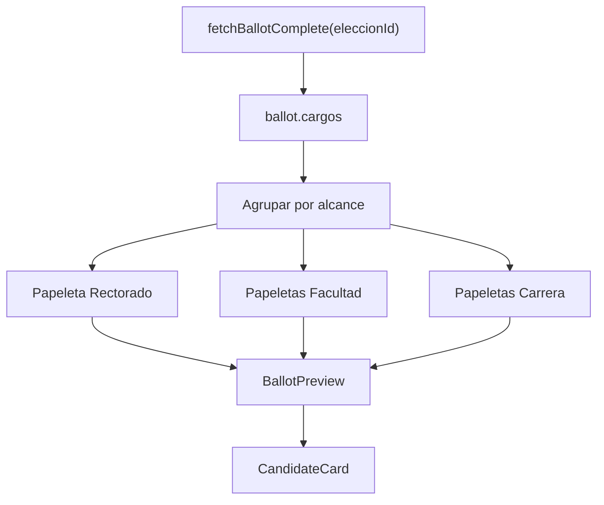

# Refactorización De Configuración De Papeleta

## Contexto Actual

La pantalla objetivo es [`SW2-grupal-frontend/src/pages/admin/electoral/ConfiguracionPapeleta.jsx`](SW2-grupal-frontend/src/pages/admin/electoral/ConfiguracionPapeleta.jsx). Hoy construye `ballotColumns` agrupando por frente político y luego lista cargos/candidatos dentro de cada frente. Eso sirve para comparar frentes, pero no simula la experiencia real del votante cuando existen papeletas separadas por alcance.

Los datos necesarios ya existen en el frontend:

- [`SW2-grupal-frontend/src/services/electionsService.js`](SW2-grupal-frontend/src/services/electionsService.js) documenta `Papeleta` con `alcance?: 'GLOBAL' | 'FACULTAD' | 'CARRERA'`, `facultadNombre`, `carreraNombre`, etc.
- [`SW2-grupal-frontend/src/utils/papeletaConstants.js`](SW2-grupal-frontend/src/utils/papeletaConstants.js) ya contiene `ALCANCE_PAPELETA`, `ALCANCE_LABELS`, `formatPapeletaLabel()` y `formatAmbito()`.
- Cada candidato llega asociado a una papeleta mediante `candidate.eleccionCargo` en el flujo de candidatos, y en la papeleta completa cada cargo trae sus `frentes` con `candidatos`.

## Flujo Objetivo



## Filtrado Y Agrupación De Datos

1. Reemplazar el `useMemo` actual `ballotColumns` por un `useMemo` nuevo, por ejemplo `ballotPreviews`.

2. La unidad principal no debe ser el frente, sino cada papeleta/cargo de `ballot.cargos`.

3. Para separar lógicamente los grupos:

- Rectorado: `cargo.alcance === 'GLOBAL'` o, como fallback conservador, `cargo.nombre` contiene `Rector`.
- Decanato: `cargo.alcance === 'FACULTAD'` o fallback por `Decano`.
- Dirección de Carrera: `cargo.alcance === 'CARRERA'` o fallback por `Director`/`Carrera`.

4. Dentro de cada papeleta, transformar sus frentes en tarjetas de candidatura. El modelo intermedio recomendado:

```js
{
  id,
  type: 'GLOBAL' | 'FACULTAD' | 'CARRERA',
  title,
  subtitle,
  order,
  emptyMessage,
  fronts: [
    {
      id,
      nombreFrente,
      sigla,
      logoUrl,
      candidates: [],
    }
  ],
}
```

5. Orden visual recomendado:

- Primero `GLOBAL`.
- Luego `FACULTAD`, ordenadas por `facultadNombre`.
- Luego `CARRERA`, ordenadas por `facultadNombre` y `carreraNombre`.

6. Mantener una función pequeña para el orden, por ejemplo `getBallotPreviewOrder(alcance)`, para evitar lógica repetida en JSX.

## Estructura De Componentes

Crear componentes pequeños dentro de la misma carpeta al inicio, para no sobredimensionar la refactorización:

- [`SW2-grupal-frontend/src/pages/admin/electoral/components/BallotPreview.jsx`](SW2-grupal-frontend/src/pages/admin/electoral/components/BallotPreview.jsx)
- [`SW2-grupal-frontend/src/pages/admin/electoral/components/CandidateCard.jsx`](SW2-grupal-frontend/src/pages/admin/electoral/components/CandidateCard.jsx)
- Opcional: [`SW2-grupal-frontend/src/pages/admin/electoral/components/BallotEmptyState.jsx`](SW2-grupal-frontend/src/pages/admin/electoral/components/BallotEmptyState.jsx), solo si el JSX queda muy cargado.

Recomendación: usar `<BallotPreview />` como componente principal reutilizable. `PapeletaCard` sería un buen nombre si la tarjeta representara una papeleta completa, pero `BallotPreview` comunica mejor que se trata de una previsualización de votación.

Responsabilidades:

- `ConfiguracionPapeleta.jsx`: cargar elección, construir `ballotPreviews`, manejar estados globales de carga/error/vacío.
- `BallotPreview`: renderizar una papeleta individual con encabezado, descripción de ámbito y grilla de frentes/candidaturas.
- `CandidateCard`: renderizar foto, nombre completo, rol específico y frente.

## Diseño UI Con Tailwind

La vista debe pasar de “columnas por frente” a “secciones por papeleta”. Cada papeleta será una card grande:

- Contenedor: `rounded-xl border border-slate-200 bg-white p-5 shadow-sm`.
- Encabezado con etiqueta clara: `Papeleta 1: Rector y Vicerrector`, `Papeleta 2: Decano y Vicedecano`, `Papeleta 3: Dirección de Carrera`.
- Subtítulo contextual: `Universidad`, nombre de facultad o nombre de carrera.
- Badge de alcance: `Global`, `Facultad`, `Carrera` usando `ALCANCE_LABELS`.
- Grilla interna: `grid grid-cols-1 gap-4 md:grid-cols-2 xl:grid-cols-3`.

Cada candidatura/frente se verá como una card:

- Logo o placeholder del frente arriba.
- Nombre del frente y sigla.
- Lista de candidatos debajo, con foto, nombre completo y rol (`Rector`, `Vicerrector`, `Decano`, etc.).
- Si una fórmula tiene dos roles, mostrarlos como dos filas dentro de la misma card.

Ejemplo visual esperado, sin implementar todavía:

- `Papeleta 1: Rector y Vicerrector`
  - Card Frente A: Rector + Vicerrector.
  - Card Frente B: Rector + Vicerrector.
- `Papeleta 2: Decano y Vicedecano - Facultad de Ingeniería`
  - Card Frente A: Decano + Vicedecano.
- `Papeleta 3: Director de Carrera - Ingeniería Informática`
  - Card Frente A: Director de Carrera.

## Manejo De Casos Borde

- Elección sin `ballot`: mantener el estado actual “Sin información para mostrar”.
- Elección con `ballot.cargos` vacío: mantener “Sin cargos registrados”.
- No hay `GLOBAL`: no renderizar una tarjeta vacía de Rectorado; mostrar solo las papeletas existentes. Agregar un texto auxiliar: “Esta elección no incluye papeleta de Rectorado”.
- Solo nivel Facultad: renderizar únicamente papeletas `FACULTAD`; no mostrar espacios en blanco para Rectorado o Carrera.
- Solo nivel Carrera: renderizar únicamente papeletas `CARRERA`, agrupadas visualmente por facultad si hay varias.
- Papeleta con frentes pero sin candidatos: mostrar dentro de esa papeleta “Sin candidatos registrados para esta papeleta”.
- Papeleta con candidato sin foto: mostrar placeholder consistente con el estilo actual.
- Candidato sin `rolEspecifico`: mostrar “Rol no asignado” para evitar una card ambigua.
- Datos antiguos sin `alcance`: tratar como `GLOBAL` solo como fallback de compatibilidad visual.

## Pasos Lógicos De Implementación

1. Auditar la forma real de `ballot.cargos` en la respuesta de `fetchBallotComplete()` con una elección multialcance existente.
2. Extraer helpers puros en `ConfiguracionPapeleta.jsx` o en un archivo local `ballotPreviewUtils.js` si crecen demasiado.
3. Reemplazar `ballotColumns` por `ballotPreviews`, agrupando por papeleta/cargo y ordenando por alcance.
4. Crear `<BallotPreview />` para encapsular cada papeleta.
5. Crear `<CandidateCard />` para la tarjeta individual de frente/candidatos.
6. Actualizar el JSX principal para renderizar `ballotPreviews.map(...)` en secciones verticales.
7. Mantener los estados existentes de carga, error, sin elección, sin ballot y sin cargos.
8. Verificar manualmente elecciones con combinaciones: solo Rectorado, solo Facultad, solo Carrera y multialcance.

## Decisión Recomendada

Usar `<BallotPreview />` como componente reutilizable principal y `CandidateCard` como componente interno de presentación. Esto deja `ConfiguracionPapeleta.jsx` concentrado en carga/transformación de datos y hace que la UI sea fácil de ajustar sin tocar la lógica de API.