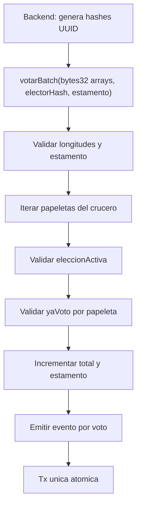

# Plan: Votación Batch Hash-Based

## Decisión De Diseño

El contrato actual en [`sw2-grupal-blockchain/contracts/Votacion.sol`](sw2-grupal-blockchain/contracts/Votacion.sol) usa hashes `bytes32` derivados de UUIDs y ya expone `votar(bytes32, bytes32, bytes32)`, `yaVoto`, `votos` y `totalVotosPorEleccion`. Mantendremos ese modelo para no romper la generación de hashes del backend.

En vez de migrar a IDs `uint256`, se agregará una capa de conteo paritario por estamento:

```solidity
struct ConteoPorEstamento {
    uint256 votosEstudiantes;
    uint256 votosDocentes;
}
```

El nuevo batch será:

```solidity
function votarBatch(
    bytes32[] calldata _elecciones,
    bytes32[] calldata _candidatos,
    bytes32 _electorHash,
    uint8 _estamento
) external soloAdmin;
```

## Cambios En Contrato

En [`sw2-grupal-blockchain/contracts/Votacion.sol`](sw2-grupal-blockchain/contracts/Votacion.sol):

- Conservar `admin`, `yaVoto`, `votos`, `totalVotosPorEleccion`, `totalVotosGlobal`, `votar(...)` y los getters actuales para compatibilidad.
- Agregar `mapping(bytes32 => bool) public eleccionActiva;` para validar que cada papeleta/elección hash esté habilitada on-chain antes de aceptar batch.
- Agregar una función admin, por ejemplo `configurarEleccionActiva(bytes32 _eleccionHash, bool _activa)`, para activar/cerrar elecciones en pruebas y despliegues.
- Agregar `mapping(bytes32 => mapping(bytes32 => ConteoPorEstamento)) private votosPorEstamento;`.
- Implementar `votarBatch(...)` con validaciones estrictas:
  - `_elecciones.length == _candidatos.length`.
  - `_elecciones.length > 0`.
  - `_estamento` solo puede ser `0` estudiante o `1` docente.
  - cada `_elecciones[i]` debe estar activa.
  - `!yaVoto[_elecciones[i]][_electorHash]` para impedir doble voto por papeleta.
- Ejecutar el loop marcando `yaVoto`, incrementando el total existente (`votos`, `totalVotosPorEleccion`, `totalVotosGlobal`) y el contador paritario correspondiente.
- Emitir un evento por cada voto del batch, incluyendo `estamento`; preferiblemente un evento nuevo para no romper el evento legacy:

```solidity
event VotoBatchRegistrado(
    bytes32 indexed eleccionHash,
    bytes32 indexed candidatoHash,
    bytes32 electorHash,
    uint8 estamento,
    uint256 timestamp
);
```

- Agregar getters de consulta paritaria, por ejemplo:
  - `obtenerVotosEstudiantes(bytes32 _eleccionHash, bytes32 _candidatoHash)`.
  - `obtenerVotosDocentes(bytes32 _eleccionHash, bytes32 _candidatoHash)`.
  - opcionalmente `obtenerVotosPorEstamento(...) returns (uint256 estudiantes, uint256 docentes)`.

## Pruebas Unitarias

En [`sw2-grupal-blockchain/test/Votacion.test.ts`](sw2-grupal-blockchain/test/Votacion.test.ts):

- Mantener los casos actuales de `votar(...)` para proteger compatibilidad.
- Agregar un bloque `describe("votarBatch", ...)` usando el helper actual `desplegarContrato()`.
- Crear hashes de tres papeletas concurrentes para simular Rectorado, Decanato y Dirección de Carrera.
- Camino feliz estudiante:
  - activar las tres elecciones con `configurarEleccionActiva`.
  - llamar `votarBatch([rectorado, decanato, carrera], [candA, candB, candC], elector1, 0)`.
  - verificar `obtenerVotos`, `obtenerTotalVotos`, `totalVotosGlobal` y `obtenerVotosEstudiantes`.
- Camino feliz docente:
  - repetir con otro elector y `_estamento = 1`.
  - verificar `obtenerVotosDocentes` y que estudiantes/docentes queden separados.
- Fallas requeridas:
  - arrays de tamaños desiguales revierte.
  - `_estamento` distinto de `0` o `1` revierte.
  - elección inexistente/no activa revierte.
  - elección cerrada revierte después de `configurarEleccionActiva(hash, false)`.
  - mismo `_electorHash` intentando votar dos veces en una papeleta revierte.
  - duplicar la misma elección dentro del mismo lote con el mismo elector revierte y la transacción completa no deja efectos parciales.
- Validar emisión de `VotoBatchRegistrado` por cada item del lote.

## Despliegue Y Artefactos

El proyecto actual no tiene [`sw2-grupal-blockchain/scripts/deploy.js`](sw2-grupal-blockchain/scripts/deploy.js); se añadirá como script de conveniencia y se mantendrá [`sw2-grupal-blockchain/ignition/modules/Votacion.ts`](sw2-grupal-blockchain/ignition/modules/Votacion.ts).

- Crear `scripts/deploy.js` usando `ethers.getContractFactory("Votacion")`, `deploy()`, `waitForDeployment()` y `getAddress()`.
- Imprimir la dirección con una línea clara para copiarla a `VOTACION_CONTRACT_ADDRESS`.
- Agregar en [`sw2-grupal-blockchain/package.json`](sw2-grupal-blockchain/package.json) un script como `"deploy": "hardhat run scripts/deploy.js"`.
- Mantener Ignition sin cambios de constructor, ya que `Votacion` seguirá desplegándose sin argumentos.
- Después de compilar, regenerar artefactos y TypeChain con `pnpm run compile`.
- Si el backend va a consumir `votarBatch`, sincronizar posteriormente el ABI actualizado hacia `SW2-grupal-backend/src/blockchain/abi/VotacionABI.json` en una tarea separada o en la integración posterior.

## Verificación

- Ejecutar `pnpm run compile` en `sw2-grupal-blockchain`.
- Ejecutar `pnpm test` en `sw2-grupal-blockchain`.
- Opcional para despliegue local: levantar `pnpm run local-node` y ejecutar `pnpm run deploy -- --network localhost`.

## Flujo Esperado



## Riesgos Y Alcance

- El contrato no podrá inferir si una elección está activa desde la base de datos; por eso el plan agrega estado `eleccionActiva` administrado on-chain.
- `votar(...)` legacy no recibe estamento; se conservará para compatibilidad, pero el flujo nuevo debe usar `votarBatch(...)` para conteo paritario correcto.
- El backend necesitará una integración posterior para llamar `votarBatch` y activar/cerrar hashes on-chain cuando la jornada cambie.