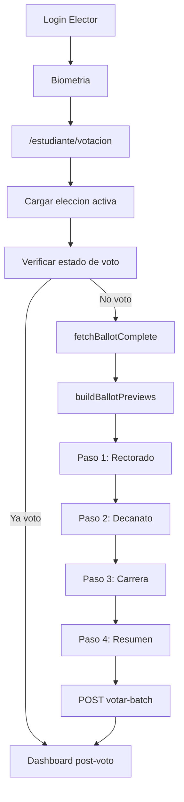

# Plan Técnico: Crucero De Votación

## 1. Contexto Actual Del Frontend

El frontend vive en [`SW2-grupal-frontend`](SW2-grupal-frontend) y usa React + Vite + JavaScript, con rutas centralizadas en [`SW2-grupal-frontend/src/routes/AppRoutes.jsx`](SW2-grupal-frontend/src/routes/AppRoutes.jsx). El flujo elector actual apunta a [`SW2-grupal-frontend/src/pages/VotingBallot.jsx`](SW2-grupal-frontend/src/pages/VotingBallot.jsx), una pantalla única que carga la elección activa, consulta la papeleta y emite un voto legacy mediante [`SW2-grupal-frontend/src/services/votoService.js`](SW2-grupal-frontend/src/services/votoService.js).

Piezas ya reutilizables:

- [`SW2-grupal-frontend/src/services/api.js`](SW2-grupal-frontend/src/services/api.js): cliente Axios con `Authorization: Bearer` desde `sessionStorage`.
- [`SW2-grupal-frontend/src/services/electionsService.js`](SW2-grupal-frontend/src/services/electionsService.js): `fetchElections()` y `fetchBallotComplete(electionId, registro)`.
- [`SW2-grupal-frontend/src/services/certificadoService.js`](SW2-grupal-frontend/src/services/certificadoService.js): estado post-voto y descarga de certificado.
- [`SW2-grupal-frontend/src/pages/admin/electoral/ballotPreviewUtils.js`](SW2-grupal-frontend/src/pages/admin/electoral/ballotPreviewUtils.js): `buildBallotPreviews()` ya ordena papeletas por alcance `GLOBAL -> FACULTAD -> CARRERA`.
- [`SW2-grupal-frontend/src/utils/papeletaConstants.js`](SW2-grupal-frontend/src/utils/papeletaConstants.js): constantes `ALCANCE_PAPELETA`, labels y roles por alcance.

Limitación actual: [`VotingBallot.jsx`](SW2-grupal-frontend/src/pages/VotingBallot.jsx) agrupa frentes y envía un voto individual legacy; no conserva selecciones por papeleta ni consume `/elecciones/candidato/votar-batch`.

## 2. Objetivo Del Flujo Wizard

Implementar un wizard de 4 pasos para el votante:

1. Rectorado: papeleta de alcance `GLOBAL`.
2. Decanato: papeleta de alcance `FACULTAD`, ya filtrada por el backend según el elector.
3. Dirección de Carrera: papeleta de alcance `CARRERA`, ya filtrada por el backend según el elector.
4. Resumen de Sufragio: confirmación final y envío batch atómico.

El frontend no debe recalcular la elegibilidad por facultad/carrera. Debe consumir `fetchBallotComplete(activeElectionId, registro)`, porque el backend ya recibe el `registro` del JWT y devuelve las papeletas aplicables al elector.

## 3. Arquitectura Propuesta

Reemplazar gradualmente la UI interna de [`VotingBallot.jsx`](SW2-grupal-frontend/src/pages/VotingBallot.jsx) por un contenedor wizard, conservando:

- Carga de elección activa.
- Verificación `verificarEstadoVoto(active.id)`.
- Decodificación de JWT para obtener `registro`.
- Pantalla post-voto con certificado, estadísticas y hash blockchain.

Componentes propuestos:

- `src/pages/VotingBallot.jsx`: queda como página orquestadora: carga datos, maneja estados globales y renderiza wizard o post-voto.
- `src/components/votacion/VotingWizard.jsx`: contenedor del stepper, estado temporal y navegación.
- `src/components/votacion/BallotStep.jsx`: muestra una papeleta y permite elegir un frente/candidato o voto en blanco.
- `src/components/votacion/VotingSummary.jsx`: resumen final con las tres selecciones y botón "Emitir Voto".
- `src/components/votacion/BlankVoteCard.jsx`: tarjeta visual obligatoria para "Voto en Blanco".
- `src/components/votacion/WizardProgress.jsx`: indicador visual de pasos `1/4`, `2/4`, etc.

Estructura esperada:

```text
SW2-grupal-frontend/src/components/votacion/
  VotingWizard.jsx
  BallotStep.jsx
  VotingSummary.jsx
  BlankVoteCard.jsx
  WizardProgress.jsx
```

## 4. Modelo De Datos En UI

Usar estado local en `VotingWizard.jsx`; no hace falta Redux/Zustand porque el flujo vive dentro de una página protegida.

Estado recomendado:

```js
const [currentStepIndex, setCurrentStepIndex] = useState(0)
const [selectionsByBallot, setSelectionsByBallot] = useState({})
```

Forma interna:

```js
{
  [eleccionCargoId]: {
    eleccionCargoId: 'uuid-papeleta',
    candidatoId: 'uuid-candidato',
    frenteId: 'uuid-frente',
    nombreFrente: 'Nombre visible',
    sigla: 'ABC',
    alcance: 'GLOBAL',
    title: 'Rectorado',
    isBlankVote: false
  }
}
```

El resumen y el DTO final se derivan de ese estado:

```js
const selecciones = orderedBallots.map((ballot) => ({
  eleccionCargoId: ballot.id,
  candidatoId: selectionsByBallot[ballot.id].candidatoId,
}))
```

Validación de navegación:

- No permitir avanzar desde un paso de papeleta sin selección.
- Permitir volver atrás sin perder estado.
- En el resumen, validar que todas las papeletas requeridas tienen selección.
- Bloquear doble submit mientras `isSubmitting === true`.

## 5. Preparación De Papeletas

Usar `buildBallotPreviews(ballot)` como base para construir los pasos ordenados por alcance. Actualmente vive en una carpeta de admin:

[`SW2-grupal-frontend/src/pages/admin/electoral/ballotPreviewUtils.js`](SW2-grupal-frontend/src/pages/admin/electoral/ballotPreviewUtils.js)

Para evitar dependencias desde elector hacia `pages/admin`, mover o duplicar de forma controlada los helpers compartidos a:

```text
SW2-grupal-frontend/src/utils/ballotPreviewUtils.js
```

Luego actualizar imports de:

- [`SW2-grupal-frontend/src/pages/admin/electoral/ConfiguracionPapeleta.jsx`](SW2-grupal-frontend/src/pages/admin/electoral/ConfiguracionPapeleta.jsx)
- componentes admin que usen `ballotPreviewUtils`
- nuevo wizard elector

El wizard debe construir:

```js
const orderedBallots = buildBallotPreviews(ballot)
```

Orden esperado:

- `GLOBAL` primero.
- `FACULTAD` segundo.
- `CARRERA` tercero.

Si una elección no trae exactamente tres papeletas, el wizard debe renderizar solo las disponibles y mantener el paso final como resumen. El copy puede indicar "Esta elección no incluye papeleta de Decanato" o "Dirección de Carrera" usando la lógica de `getMissingAlcanceHints()`.

## 6. Voto En Blanco

Requerimiento UX: cada paso debe mostrar una opción visual de "Voto en Blanco".

Decisión técnica necesaria: el backend exige `candidatoId` UUID en cada selección. Por tanto, "Voto en Blanco" no debe enviarse como `null`, string mágico ni candidato inexistente. Debe mapearse a un candidato real configurado por papeleta.

Estrategia recomendada:

- En cada papeleta, detectar un frente/candidato de blanco por convención de datos:
  - `nombreFrente`, `sigla`, `rolEspecifico`, `nombres` o `apellidos` que contengan `BLANCO`.
- Si existe, `BlankVoteCard` usa ese `candidatoId`.
- Si no existe, el wizard muestra un error de configuración: "La opción Voto en Blanco no está configurada para esta papeleta".

Esta estrategia mantiene el contrato del endpoint batch:

```json
{
  "eleccionId": "uuid-de-la-eleccion-activa",
  "selecciones": [
    { "eleccionCargoId": "uuid-rectorado", "candidatoId": "uuid-candidato-o-blanco" }
  ]
}
```

## 7. Integración Con Backend

Extender [`SW2-grupal-frontend/src/services/votoService.js`](SW2-grupal-frontend/src/services/votoService.js) sin eliminar `emitirVoto()` legacy.

Agregar:

```js
export async function emitirVotoBatch(eleccionId, selecciones) {
  const response = await api.post('/elecciones/candidato/votar-batch', {
    eleccionId,
    selecciones,
  })
  return response?.data?.data
}
```

Responsabilidades del frontend:

- Enviar solo `eleccionId` y `selecciones`.
- No enviar `electorId`; el backend lo toma del JWT.
- No enviar `estamento`; el backend lo infiere del elector autenticado.
- Usar el token existente; `api.js` ya agrega `Authorization`.

En `VotingSummary.jsx`, el botón "Emitir Voto" llama a `onSubmitBatch(selecciones)` y el contenedor ejecuta:

```js
const result = await emitirVotoBatch(activeElectionId, selecciones)
setTxHash(result?.hashTransaccion)
setHaVotado(true)
```

## 8. Cambios En Routing

Mantener la ruta actual para no romper navegación existente:

[`SW2-grupal-frontend/src/routes/AppRoutes.jsx`](SW2-grupal-frontend/src/routes/AppRoutes.jsx)

```jsx
<Route path="/estudiante/votacion" element={<VotingBallot />} />
```

No se recomienda crear una nueva ruta en la primera iteración. El wizard reemplaza el contenido de la papeleta dentro de la ruta existente.

Opcional posterior:

- Crear `/estudiante/votacion/wizard`.
- Redirigir `/estudiante/votacion` a la ruta nueva.

## 9. UI Y Comportamiento Por Paso

### Paso 1: Rectorado

- Fuente: papeleta con `type === ALCANCE_PAPELETA.GLOBAL`.
- Título: `Rectorado` o `preview.title`.
- Cards: frentes postulados a Rectorado + `Voto en Blanco`.
- Selección persistida en `selectionsByBallot[preview.id]`.

### Paso 2: Decanato

- Fuente: papeleta con `type === ALCANCE_PAPELETA.FACULTAD`.
- El backend ya devuelve la facultad aplicable.
- Mostrar subtítulo con `preview.subtitle`.
- Cards: frentes de Decanato + `Voto en Blanco`.

### Paso 3: Dirección De Carrera

- Fuente: papeleta con `type === ALCANCE_PAPELETA.CARRERA`.
- El backend ya devuelve la carrera aplicable.
- Mostrar subtítulo con `preview.subtitle`.
- Cards: frentes de Dirección + `Voto en Blanco`.

### Paso 4: Resumen

Mostrar:

- Elección activa (`electionLabel`).
- Papeleta / alcance.
- Frente o "Voto en Blanco".
- Candidato principal visible.
- Aviso de irreversibilidad: "Al confirmar, se emitirá una única transacción atómica en blockchain".
- Botones: "Volver", "Emitir Voto".

## 10. Manejo De Errores

Casos a cubrir:

- No hay elección activa: reutilizar mensaje actual.
- `verificarEstadoVoto` indica que ya votó: reutilizar dashboard post-voto.
- No hay papeletas aplicables: mensaje claro.
- Falta candidato de blanco en alguna papeleta: bloquear emisión y mostrar error de configuración.
- Error 401/403: sugerir volver a iniciar sesión.
- Error del batch blockchain: mostrar `error?.response?.data?.message || error.message`.
- Submit duplicado: deshabilitar botones durante envío.

## 11. Reutilización Del Post-Voto

El bloque post-voto actual de [`VotingBallot.jsx`](SW2-grupal-frontend/src/pages/VotingBallot.jsx) debe mantenerse:

- Mensaje de voto registrado.
- Descarga de certificado.
- Estadísticas por estamento (`getEstadisticasDocentes` / `getEstadisticasEstudiantes`).
- Visualización y copia de `txHash`.

Después de `emitirVotoBatch`, se debe cargar estadísticas igual que el flujo actual.

## 12. Secuencia Técnica De Implementación

1. Mover helpers compartidos de papeleta a `src/utils/ballotPreviewUtils.js` y actualizar imports admin.
2. Extender `votoService.js` con `emitirVotoBatch(eleccionId, selecciones)`.
3. Crear componentes en `src/components/votacion/`.
4. Refactorizar `VotingBallot.jsx` para:
   - Mantener carga y post-voto.
   - Reemplazar la UI legacy de selección única por `VotingWizard`.
   - Pasar `ballot`, `activeElectionId`, `electionLabel`, `role`, `token` y callbacks.
5. Implementar detección de "Voto en Blanco" por papeleta.
6. Construir DTO batch desde `selectionsByBallot`.
7. Probar flujo estudiante y docente con elección activa.
8. Validar que `/estudiante/dashboard` y biometría sigan navegando a `/estudiante/votacion`.

## 13. Flujo Propuesto



## 14. Riesgos Y Decisiones Pendientes

- "Voto en Blanco" requiere un `candidatoId` real. Si la base de datos no lo crea automáticamente, habrá que agregarlo en configuración electoral antes de habilitar este wizard.
- El frontend actual usa JavaScript sin tipos fuertes; se recomienda JSDoc para `SeleccionVoto`, `VotoBatchComprobante` y `WizardSelection`.
- El endpoint `verificarEstadoVoto(eleccionId)` parece operar a nivel de elección. Si el certificado considera una elección votada con cualquier papeleta, el batch encaja bien; si requiere todas las papeletas, conviene validar la lógica backend.
- El flujo legacy `emitirVoto()` debe conservarse inicialmente, pero la UI del elector debe usar `emitirVotoBatch()`.

## 15. Criterios De Aceptación

- El votante puede recorrer Rectorado, Decanato, Carrera y Resumen sin perder selecciones.
- Cada papeleta muestra frentes disponibles y opción visible "Voto en Blanco".
- El resumen muestra las tres decisiones antes de confirmar.
- El submit envía un único POST a `/elecciones/candidato/votar-batch`.
- El payload cumple `{ eleccionId, selecciones: [{ eleccionCargoId, candidatoId }] }`.
- Tras votar, la UI muestra el hash de la única transacción blockchain.
- Se conserva el flujo post-voto de certificado y estadísticas.
- Los métodos legacy de voto no se eliminan.
