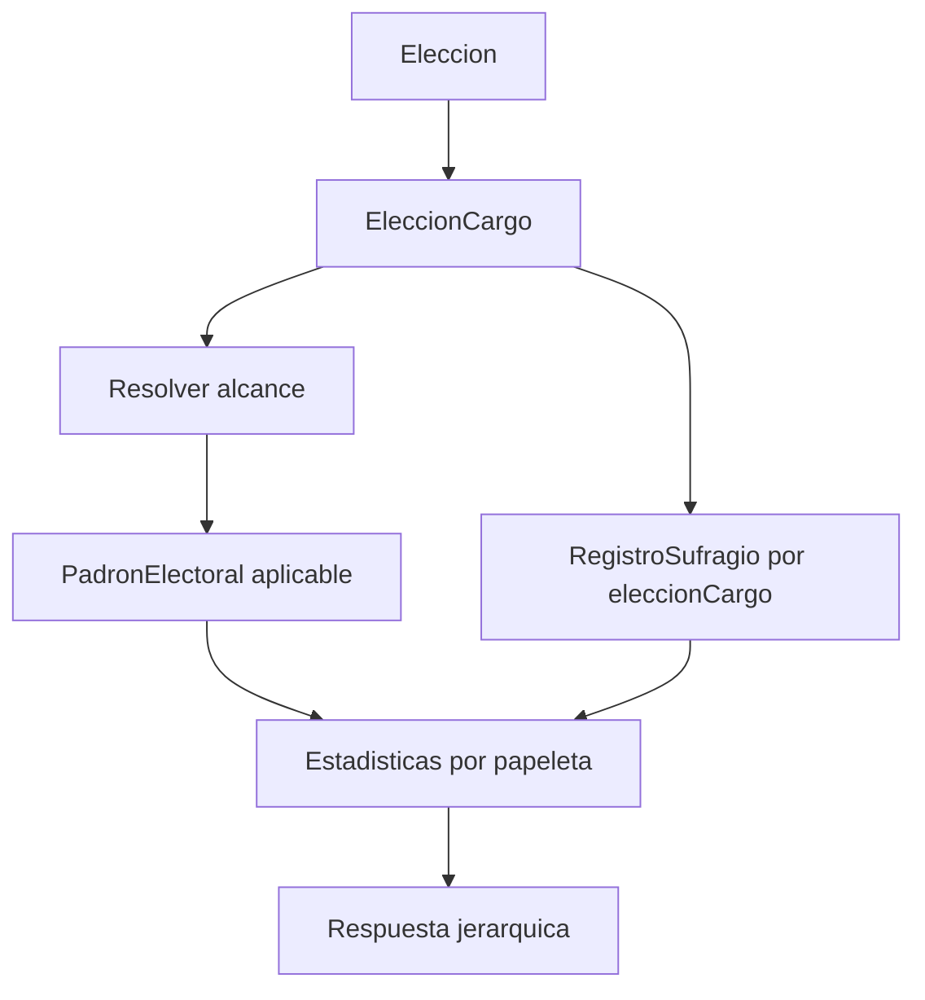
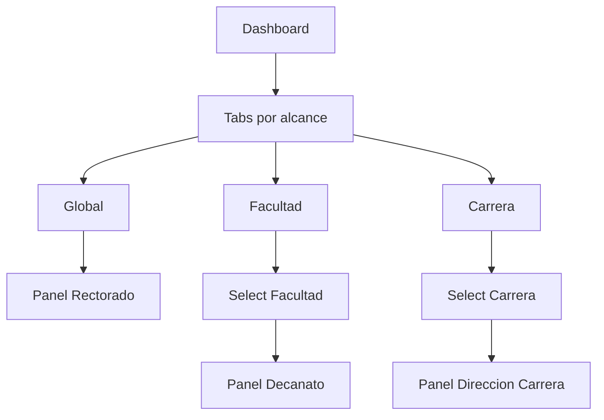

# Plan De Refactorización: Estadísticas En Vivo

## Objetivo

Refactorizar la pantalla [`SW2-grupal-frontend/src/pages/admin/electoral/EstadisticasEnVivo.jsx`](SW2-grupal-frontend/src/pages/admin/electoral/EstadisticasEnVivo.jsx) para que deje de mostrar datos mezclados o estáticos y pase a representar la participación electoral según la estructura jerárquica real de la elección:

- **Global**: Rectorado.
- **Facultad**: Decanato.
- **Carrera**: Dirección de Carrera.

La vista debe funcionar tanto antes de iniciar la votación, cuando la elección está `SELLADA`, como durante la jornada activa, usando datos reales del backend y, cuando aplique, de blockchain.

## Hallazgos Actuales

- El frontend usa **Recharts** (`recharts` en [`SW2-grupal-frontend/package.json`](SW2-grupal-frontend/package.json)).
- La pantalla actual consume tres endpoints desde [`SW2-grupal-frontend/src/services/estadisticasService.js`](SW2-grupal-frontend/src/services/estadisticasService.js):
  - `GET /estadisticas/participacion/:eleccionId`
  - `GET /estadisticas/estudiantes/:eleccionId`
  - `GET /estadisticas/docentes/:eleccionId`
- El backend actual en [`SW2-grupal-backend/src/elecciones/services/estadisticas.service.ts`](SW2-grupal-backend/src/elecciones/services/estadisticas.service.ts) calcula participación global por elección y por estamento, pero todavía no expone una respuesta agrupada por papeleta.
- El modelo ya permite agrupar por papeleta porque [`RegistroSufragio`](SW2-grupal-backend/src/elecciones/entities/registro-sufragio.entity.ts) tiene relación con `eleccionCargo`, y [`EleccionCargo`](SW2-grupal-backend/src/elecciones/entities/eleccion-cargo.entity.ts) contiene `alcance`, `codFacultad`, `facultadNombre`, `codCarrera` y `carreraNombre`.

## Contrato De Datos Propuesto

Crear un endpoint nuevo para no romper los endpoints actuales:

- `GET /estadisticas/jerarquicas/:eleccionId`

Respuesta recomendada:

```js
{
  eleccionId,
  tituloEleccion,
  estado, // EN_CONFIGURACION | SELLADA | ACTIVA
  ultimaActualizacion,
  resumenGeneral: {
    totalHabilitados,
    totalVotosEmitidos,
    porcentajeParticipacion,
  },
  papeletas: [
    {
      eleccionCargoId,
      cargoNombre,
      alcance, // GLOBAL | FACULTAD | CARRERA
      orden,
      ambito: {
        codFacultad,
        facultadNombre,
        codCarrera,
        carreraNombre,
      },
      habilitados,
      votosEmitidos,
      porcentajeParticipacion,
      porEstamento: {
        estudiante: { habilitados, votos, porcentaje },
        docente: { habilitados, votos, porcentaje },
        administrativo: { habilitados, votos, porcentaje },
      },
      series: [
        { name: 'Habilitados', value: 0 },
        { name: 'Votos emitidos', value: 0 },
        { name: 'Pendientes', value: 0 }
      ]
    }
  ]
}
```

## Procesamiento Backend

En [`EstadisticasService`](SW2-grupal-backend/src/elecciones/services/estadisticas.service.ts), agregar un método `obtenerEstadisticasJerarquicas(eleccionId)`.

El procesamiento debe seguir esta lógica:

1. Cargar la elección con sus `eleccionCargos` y `cargo`.
2. Obtener habilitados desde `PadronElectoral` y `Elector`.
3. Para cada `EleccionCargo`, calcular electores habilitados aplicables según su `alcance`:
   - `GLOBAL`: todos los habilitados del padrón, respetando reglas como `habilitadoRector` si aplican.
   - `FACULTAD`: electores cuyo `codFacultad` coincida con la papeleta.
   - `CARRERA`: electores cuyo `codFacultad` y `codCarrera` coincidan con la papeleta.
4. Obtener votos desde `RegistroSufragio` agrupando por `eleccionCargo.id` y `elector.estamento`.
5. Armar una lista normalizada de papeletas, incluso si no hay votos.
6. Si la elección está `SELLADA` y todavía no tiene registros de sufragio, devolver todos los contadores de votos en `0`, no `null`.

Flujo de agregación:



## Estado Inicial Con Cero Votos

El dashboard no debe mostrar espacios vacíos ni datos dummy cuando la elección esté `SELLADA`.

Regla recomendada:

- Si `estado === 'SELLADA'` y `totalVotosEmitidos === 0`, mostrar un estado profesional de “pre-jornada”:
  - Total habilitados real.
  - Votos emitidos: `0`.
  - Participación: `0.00%`.
  - Pendientes: igual a habilitados.
  - Mensaje informativo: “La elección está sellada y lista para iniciar. Aún no se registran votos.”

Para cada papeleta:

```js
{
  votosEmitidos: 0,
  porcentajeParticipacion: 0,
  porEstamento: {
    estudiante: { votos: 0, porcentaje: 0 },
    docente: { votos: 0, porcentaje: 0 },
    administrativo: { votos: 0, porcentaje: 0 },
  }
}
```

Esto evita que Recharts reciba `undefined` y permite dibujar barras en cero con una etiqueta clara.

## Arquitectura Frontend

Refactorizar [`EstadisticasEnVivo.jsx`](SW2-grupal-frontend/src/pages/admin/electoral/EstadisticasEnVivo.jsx) hacia componentes especializados:

- `EstadisticasEnVivo.jsx`
  - Carga elecciones.
  - Selecciona elección.
  - Consume `getEstadisticasJerarquicas(eleccionId)`.
  - Maneja polling, loading, error y estado sellado.
- `components/estadisticas/StatsSummaryCards.jsx`
  - Cards de habilitados, votos emitidos, participación y pendientes.
- `components/estadisticas/BallotScopeTabs.jsx`
  - Selector de alcance: Global, Facultad, Carrera.
- `components/estadisticas/BallotSelector.jsx`
  - Select dinámico para elegir una papeleta específica dentro del alcance seleccionado.
- `components/estadisticas/BallotParticipationPanel.jsx`
  - Vista central de una papeleta: resumen, gráfico y desglose por estamento.
- `components/estadisticas/EmptyVotingState.jsx`
  - Estado inicial con cero votos para elección sellada.
- `utils/estadisticasHierarchy.js`
  - Funciones puras para ordenar, agrupar y preparar datos para gráficos.

## Filtrado Jerárquico En UI

El usuario no debería perderse entre Rectorado, Decanato y Carrera. Recomiendo una navegación de dos niveles:

1. **Tabs por alcance**:
   - Global.
   - Facultad.
   - Carrera.

2. **Selector dentro del alcance**:
   - Si el tab es `GLOBAL`, mostrar directamente la papeleta global.
   - Si el tab es `FACULTAD`, mostrar un select con facultades/decandatos disponibles.
   - Si el tab es `CARRERA`, mostrar un select agrupado por facultad o un select con etiquetas `Facultad - Carrera`.

Esta combinación es más clara que un solo select largo, porque primero orienta al administrador por nivel institucional y luego por ámbito concreto.

Flujo de navegación:



## Preparación De Datos Para Recharts

Mantener **Recharts**, ya que el proyecto ya lo usa y cubre la necesidad sin introducir dependencias nuevas.

Adaptación recomendada:

- `BarChart` para comparar `Habilitados`, `Votos emitidos` y `Pendientes`.
- `PieChart` o `RadialBarChart` opcional para porcentaje de participación de la papeleta seleccionada.
- `BarChart` apilado o agrupado para desglose por estamento.
- `ResponsiveContainer` en todos los gráficos para mantener compatibilidad con layouts de Tailwind.

Datos preparados para el gráfico principal:

```js
[
  {
    name: 'Papeleta seleccionada',
    Habilitados: papeleta.habilitados,
    Emitidos: papeleta.votosEmitidos,
    Pendientes: papeleta.habilitados - papeleta.votosEmitidos,
  }
]
```

Datos preparados para estamentos:

```js
[
  {
    name: 'Estudiantil',
    Habilitados: papeleta.porEstamento.estudiante.habilitados,
    Emitidos: papeleta.porEstamento.estudiante.votos,
  },
  {
    name: 'Docente',
    Habilitados: papeleta.porEstamento.docente.habilitados,
    Emitidos: papeleta.porEstamento.docente.votos,
  },
  {
    name: 'Administrativo',
    Habilitados: papeleta.porEstamento.administrativo.habilitados,
    Emitidos: papeleta.porEstamento.administrativo.votos,
  }
]
```

## Diseño UI/UX

Estructura visual sugerida:

1. Header:
   - Título: “Estadísticas en Vivo”.
   - Selector de elección.
   - Badge de estado: `En configuración`, `Sellada`, `Activa`.
   - Indicador de actualización: “Actualizando...” o “Última actualización: HH:mm:ss”.

2. Resumen general:
   - Total habilitados.
   - Votos emitidos.
   - Participación total.
   - Papeletas monitoreadas.

3. Navegación jerárquica:
   - Tabs `Global`, `Facultad`, `Carrera`.
   - Select contextual si hay más de una papeleta en el alcance.

4. Panel de papeleta:
   - Nombre de la papeleta.
   - Ámbito: Universidad, Facultad o Carrera.
   - Cards: habilitados, emitidos, pendientes, participación.
   - Gráfico principal.
   - Tabla o mini cards por estamento.

5. Estado cero votos:
   - Card informativa neutral, no error.
   - Gráficos visibles con valores en cero.
   - Texto: “Aún no se registran votos para esta papeleta.”

## Ordenamiento Y Agrupación Frontend

Crear helpers en `utils/estadisticasHierarchy.js`:

- `groupPapeletasByAlcance(papeletas)`
- `sortPapeletasByHierarchy(papeletas)`
- `getDefaultScope(papeletas)`
- `getDefaultPapeletaForScope(scope, papeletas)`
- `buildChartDataForPapeleta(papeleta)`
- `buildEstamentoChartData(papeleta)`

Orden visual:

1. `GLOBAL`
2. `FACULTAD`, ordenado por `facultadNombre`
3. `CARRERA`, ordenado por `facultadNombre` y `carreraNombre`

## Cambios En Servicios Frontend

En [`estadisticasService.js`](SW2-grupal-frontend/src/services/estadisticasService.js), agregar:

```js
export async function getEstadisticasJerarquicas(eleccionId) {
  const response = await api.get(`/estadisticas/jerarquicas/${eleccionId}`)
  return response?.data?.data || response?.data
}
```

Mantener los métodos actuales durante la transición para no romper otras pantallas como [`VotingBallot.jsx`](SW2-grupal-frontend/src/pages/VotingBallot.jsx).

## Compatibilidad Con Blockchain

La participación en vivo debe basarse principalmente en `RegistroSufragio`, porque:

- Ya registra `eleccionCargo`.
- Evita exponer el voto elegido.
- Permite contar participación sin consultar blockchain por cada render.

Blockchain debe reservarse para resultados/escrutinio por frente o auditoría, no para participación operativa. Si se desea reconciliación futura, agregar un campo opcional:

```js
fuente: 'db' | 'blockchain' | 'mixta'
```

## Plan De Implementación

1. Backend:
   - Agregar interfaces de respuesta jerárquica en `estadisticas.service.ts`.
   - Implementar `obtenerEstadisticasJerarquicas(eleccionId)`.
   - Agregar ruta `GET /estadisticas/jerarquicas/:eleccionId` en `estadisticas.controller.ts`.
   - Asegurar que toda papeleta se devuelva aunque tenga cero votos.

2. Frontend service:
   - Agregar `getEstadisticasJerarquicas`.
   - Documentar el shape con JSDoc.

3. Frontend helpers:
   - Crear `utils/estadisticasHierarchy.js`.
   - Mover la preparación de datos de Recharts fuera del componente principal.

4. Componentización:
   - Crear `StatsSummaryCards`.
   - Crear `BallotScopeTabs`.
   - Crear `BallotSelector`.
   - Crear `BallotParticipationPanel`.
   - Crear `EmptyVotingState`.

5. Refactor de `EstadisticasEnVivo.jsx`:
   - Reemplazar los tres estados `participacion`, `estudiantes`, `docentes` por un único estado `estadisticasJerarquicas`.
   - Mantener polling cada 10 segundos.
   - Inicializar correctamente cuando la elección esté `SELLADA`.
   - Mostrar tabs/selects según las papeletas disponibles.

6. Validación manual:
   - Elección `SELLADA` sin votos: todos los contadores en `0`.
   - Elección `ACTIVA` con votos solo en Rectorado.
   - Elección con papeletas de Facultad y Carrera.
   - Papeleta sin habilitados aplicables: porcentaje `0.00%` y mensaje claro.

## Riesgos Y Consideraciones

- El endpoint actual de participación global cuenta electores participantes distintos; en un sistema con múltiples papeletas por elector, el nuevo dashboard debe decidir si “votos emitidos” representa sufragios por papeleta o electores únicos. Para la vista jerárquica se recomienda contar **sufragios por papeleta**.
- Para el resumen general, mostrar ambos conceptos si hace falta:
  - Electores participantes.
  - Sufragios emitidos.
- La elegibilidad por papeleta debe reutilizar la misma lógica conceptual de `PapeletaEligibilityService` para evitar diferencias entre lo que un votante puede votar y lo que el dashboard considera habilitado.

## Resultado Esperado

El administrador podrá monitorear la participación en vivo sin mezclar niveles institucionales. La pantalla mostrará claramente la papeleta global, las papeletas por facultad y las papeletas por carrera, con cero votos profesionalmente representados antes del inicio de la jornada y gráficos consistentes mediante Recharts.
